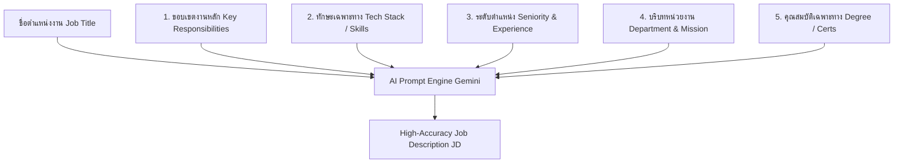

# คู่มือการเพิ่มความแม่นยำในการ Generate Job Description (JD) ด้วย AI และการออกแบบ Database บน Supabase

---

## 📌 บทนำและคำตอบสรุป (Executive Summary)

เพื่อให้ **AI (Google Gemini)** สามารถร่าง **Job Description (JD)** ได้ตรงกับตำแหน่งงานมากที่สุดและไม่ให้เนื้อหาออกมา "กว้างเกินไป (Generic)":

1. **ใช่ จำเป็นอย่างยิ่งที่ต้องระบุรายละเอียดบริบทงาน (Input Context) เพิ่มเติม** ก่อนส่งให้ AI เพราะ AI ทำงานตามหลักการ *"Context-Rich Prompting"* ยิ่งป้อนข้อมูลเฉพาะเจาะจง AI ยิ่งเจนผลลัพธ์ได้คมและตรงกับความต้องการขององค์กร 100%
2. **เรื่อง Database บน Supabase**:
   - **ตารางผลลัพธ์ (`job_descriptions`)**: ปัจจุบันในระบบมีโครงสร้างรองรับแบบ **JSONB** ครบถ้วนแล้ว (`responsibilities`, `requirements`, `preferred_skills`, `education`, `experience`, `benefits`, `salary_min`, `salary_max`)
   - **ตารางตั้งต้น (`positions` / `vacancies`)**: แนะนำให้เพิ่ม/ตรวจสอบคอลัมน์สำหรับเก็บ **Input Seeds / Requirement Parameters** เพื่อให้สามารถดึงข้อมูลมาส่งต่อให้ AI ได้อย่างเป็นระบบ

---

## 🎯 1. รายละเอียดที่ควรระบุเพิ่มเติมเพื่อให้ AI เจน JD ได้ตรงเป้าที่สุด

หากส่งเพียงแค่ "ชื่อตำแหน่ง" (เช่น *เจ้าหน้าที่บริหารงานทั่วไป* หรือ *Software Engineer*) AI จะนำข้อมูลเฉลี่ยในอินเทอร์เน็ตมาตอบ ทำให้ได้ JD ทั่วไปที่ไม่ตรงกับงานจริงในองค์กร

ควรมี **5 มิติข้อมูลหลัก (5 Core Context Dimensions)** ให้ผู้ใช้หรือระบบป้อนก่อนให้ AI เจน:



### รายละเอียดของแต่ละมิติข้อมูล:

| มิติข้อมูล (Context Dimension) | ตัวอย่างข้อมูลที่ควรป้อน | ผลกระทบต่อคุณภาพของ JD |
| :--- | :--- | :--- |
| **1. ขอบเขตงานหลัก (Key Duties & Scope)** | *เช่น "เน้นการพัฒนา Backend REST API และวางระบบ Microservices ด้วย Go"* | AI จะไม่สร้างหน้าที่กว้างๆ เช่น "พัฒนาโปรแกรมทั่วไป" แต่จะระบุการออกแบบ Database, System Architecture, API Spec |
| **2. ทักษะเฉพาะทาง (Must-Have Tech/Tools)** | *เช่น Go, PostgreSQL, Docker, Kubernetes, Redis, Kafka* | AI จะนำเครื่องมือเหล่านี้ไประบุในหัวข้อ `Preferred Skills` และ `Requirements` อย่างเจาะจง |
| **3. ระดับความอาวุโส (Seniority & Level)** | *เช่น Junior (0-2 ปี), Mid-Level (3-5 ปี), Senior (5+ ปี), Lead/Manager* | AI จะปรับระดับความรับผิดชอบ (เช่น Senior ต้องเน้น Code Review, System Design, Mentor น้อง) |
| **4. สังกัด/พันธกิจหน่วยงาน (Department/Mission)** | *เช่น สำนักบริการเทคโนโลยีสารสนเทศ (IT Support & Dev Hub)* | AI จะเข้าใจบริบทองค์กร เช่น งานวิชาการ มหาวิทยาลัย หรือธุรกิจ Tech Startup |
| **5. คุณสมบัติบังคับ & ใบรับรอง (Certs/Languages)** | *เช่น ปริญญาตรีขึ้นไป, มีใบรับรอง AWS SAA หรือคะแนน TOEIC 650+* | AI จะใส่เงื่อนไขคัดกรองที่ชัดเจนในเกณฑ์คุณสมบัติ |

---

## 💡 2. ตัวอย่างการปรับปรุง AI Prompt ในระบบ (`src/pageback/services/ai-service.ts`)

ในระบบของโปรเจกต์นี้ ฟังก์ชัน `generateJobDescription` ได้รับการออกแบบให้รองรับ Parameters เพิ่มเติม ดังนี้:

```typescript
export async function generateJobDescription(
  positionTitle: string,
  department: string,
  existingResponsibilities?: string[], // 📌 รายการหน้าที่หลักที่ต้องการเน้น
  customSkills?: string[],             // 📌 ทักษะและเครื่องมือเฉพาะทาง
  salaryMin?: number,                  // 📌 ฐานเงินเดือนขั้นต่ำ
  salaryMax?: number,                  // 📌 ฐานเงินเดือนสูงสุด
  seniorityLevel?: string,             // 📌 ระดับตำแหน่ง (Junior, Mid, Senior, Lead)
  workMode?: 'ONSITE' | 'HYBRID' | 'REMOTE', // 📌 รูปแบบการทำงาน
  specialNotes?: string                // 📌 โครงการพิเศษหรือเงื่อนไขเฉพาะ
): Promise<AIJDGenerationResponse>
```

### โครงสร้าง Prompt Template ที่สมบูรณ์แบบ:

```text
คุณคือ HR Specialist และ AI Recruitment Expert ระดับมืออาชีพ
กรุณาร่าง Job Description สำหรับตำแหน่งงานดังต่อไปนี้:

[ข้อมูลตำแหน่งงาน]
- ตำแหน่ง: {positionTitle}
- สังกัด/แผนก: {department}
- ระดับตำแหน่ง (Seniority): {seniorityLevel}
- รูปแบบการปฏิบัติงาน: {workMode}
- งบประมาณเงินเดือน: {salaryMin} - {salaryMax} THB/เดือน

[เงื่อนไขเฉพาะที่ต้องเน้น]
- หน้าที่ความรับผิดชอบหลักที่กำหนด: {existingResponsibilities}
- ทักษะเฉพาะทาง / Tools / Tech Stack: {customSkills}
- เงื่อนไขและโครงการพิเศษ: {specialNotes}

[ข้อกำหนดการสร้างผลลัพธ์]
- หน้าที่ความรับผิดชอบ (Responsibilities): ต้องมีความชัดเจน สอดคล้องกับเครื่องมือที่ระบุ มีตัวชี้วัดผลงาน
- คุณสมบัติที่ต้องการ (Requirements): ต้องตรงกับระดับ Seniority และ Tech Stack
- รูปแบบผลลัพธ์: ตอบกลับเป็น JSON Schema ภาษาไทยและภาษาอังกฤษ (Bilingual)
```

---

## 🗄️ 3. การออกแบบและปรับปรุง Database บน Supabase

### 3.1 ตาราง `job_descriptions` (ตารางผลลัพธ์ที่ AI ร่างขึ้น)
โครงสร้างปัจจุบันใน `supabase-schema.sql` ถูกออกแบบมา **สมบูรณ์แบบแล้ว** ดังนี้:

```sql
CREATE TABLE job_descriptions (
  id BIGINT GENERATED BY DEFAULT AS IDENTITY PRIMARY KEY,
  vacancy_id BIGINT REFERENCES vacancies(id) ON DELETE CASCADE NOT NULL,
  version INTEGER DEFAULT 1,
  job_title VARCHAR(200) NOT NULL,
  job_title_th VARCHAR(200),
  summary TEXT,
  summary_th TEXT,
  responsibilities JSONB DEFAULT '[]',      -- เก็บ Array หน้าที่ความรับผิดชอบ (EN)
  responsibilities_th JSONB DEFAULT '[]',   -- เก็บ Array หน้าที่ความรับผิดชอบ (TH)
  requirements JSONB DEFAULT '[]',          -- เก็บ Array คุณสมบัติ (EN)
  requirements_th JSONB DEFAULT '[]',       -- เก็บ Array คุณสมบัติ (TH)
  preferred_skills JSONB DEFAULT '[]',      -- เก็บ Array รายการทักษะเฉพาะทาง
  education JSONB DEFAULT '[]',             -- วุฒิการศึกษา
  experience JSONB DEFAULT '[]',            -- ประสบการณ์การทำงาน
  benefits JSONB DEFAULT '[]',              -- สวัสดิการ (EN)
  benefits_th JSONB DEFAULT '[]',           -- สวัสดิการ (TH)
  salary_min NUMERIC(12,2),
  salary_max NUMERIC(12,2),
  salary_currency VARCHAR(3) DEFAULT 'THB',
  generated_by_ai BOOLEAN DEFAULT FALSE,
  ai_model_version VARCHAR(50),
  ai_confidence NUMERIC(3,2),
  approved_by BIGINT REFERENCES users(id),
  approved_at TIMESTAMPTZ,
  is_current BOOLEAN DEFAULT TRUE,
  created_at TIMESTAMPTZ DEFAULT NOW()
);
```

---

### 3.2 ตาราง `vacancies` และ `positions` (แนะนำการเพิ่มคอลัมน์ Seed/Input)

หากต้องการให้ระบบ **จดจำค่าตั้งต้น** ที่ HR กรอกเข้ามาเพื่อส่งให้ AI (เช่น ทักษะที่เลือก, รูปแบบการทำงาน, หมายเหตุพิเศษ) แนะนำให้เพิ่มคอลัมน์ในตาราง `vacancies` ดังนี้:

```sql
-- เพิ่มคอลัมน์สำหรับเก็บ Input Parameters ที่ใช้สั่ง AI Generate
ALTER TABLE vacancies 
ADD COLUMN IF NOT EXISTS employment_type VARCHAR(50) DEFAULT 'FULL_TIME',  -- FULL_TIME, PART_TIME, CONTRACT
ADD COLUMN IF NOT EXISTS work_mode VARCHAR(30) DEFAULT 'ONSITE',           -- ONSITE, HYBRID, REMOTE
ADD COLUMN IF NOT EXISTS target_skills JSONB DEFAULT '[]',                 -- เช่น ["Go", "React", "PostgreSQL"]
ADD COLUMN IF NOT EXISTS target_seniority VARCHAR(30) DEFAULT 'MID_LEVEL', -- JUNIOR, MID_LEVEL, SENIOR, LEAD
ADD COLUMN IF NOT EXISTS special_instructions TEXT;                        -- รายละเอียดหรือโปรเจกต์เฉพาะที่ HR พิมพ์เพิ่ม
```

---

## 🚀 4. สรุปขั้นตอนการพัฒนาและแนวทางปฏิบัติ (Action Plan)

1. **ฝั่งหน้าบ้าน (UI Form / Modal)**:
   - ใน Modal สร้างตำแหน่งงานใหม่ (`Create Vacancy Modal`) ให้เพิ่มช่อง Input สำหรับ:
     - **ทักษะเฉพาะที่ต้องการ (Core Skills / Tags)**
     - **หน้าที่งานที่ต้องการเน้น (Key Focus Duties)**
     - **ระดับความอาวุโส (Seniority Level)**
2. **ฝั่ง Service (`ai-service.ts`)**:
   - นำค่าที่กรอกมาร้อยเรียงเข้ากับ Prompt Template ส่งไปยัง Gemini API
3. **ฝั่ง Database (`Supabase`)**:
   - บันทึกผลลัพธ์ที่ได้จาก AI ลงตาราง `job_descriptions` ในรูปแบบ JSONB ตามโครงสร้างที่มีอยู่แล้ว
   - (ตัวเลือกเสริม) เก็บ Parameters ตั้งต้นลงตาราง `vacancies` เพื่อเป็น Audit Trail ย้อนหลัง

---
*เอกสารนี้ถูกจัดทำขึ้นสำหรับโครงการ HR AI Agent System*
