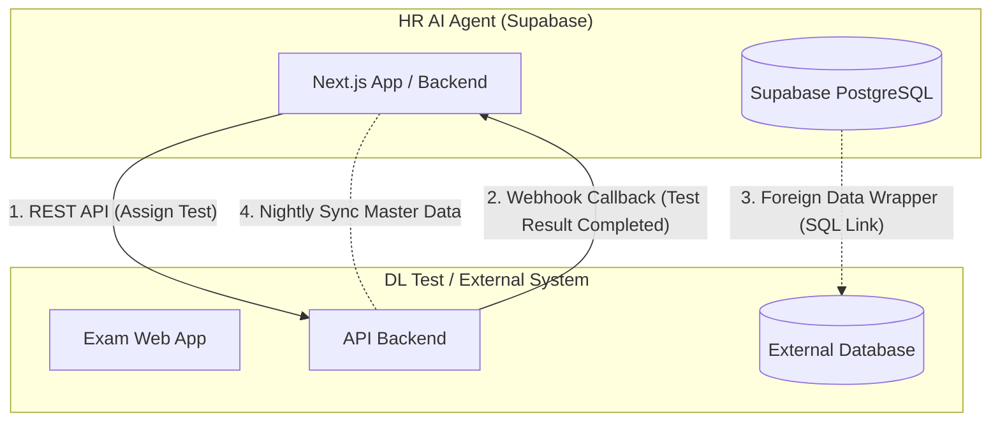

# 🌐 คู่มือสถาปัตยกรรมและการเชื่อมต่อข้ามระบบ (Cross-Database & Cross-System Integration Guide)

> **เอกสารสำหรับ:** โครงการพัฒนาระบบ HR AI Agent & ระบบภายนอก (เช่น ระบบ DL Test, มหาวิทยาลัยศรีปทุม ERP/HRIS)  
> **วัตถุประสงค์:** สรุปแนวทาง สถาปัตยกรรม ข้อดี-ข้อจำกัด และตัวอย่างการเชื่อมต่อระบบเมื่อแต่ละระบบใช้ **ฐานข้อมูลแยกต่างหาก (Isolated Databases)**

---

## 📌 1. ภาพรวมและโจทย์ทางเทคนิค (The Challenge)

เมื่อระบบต่างๆ ไม่ได้แชร์ฐานข้อมูลเดียวกัน (เช่น **ระบบ HR AI Agent** ใช้ Supabase PostgreSQL ขณะที่ **ระบบ DL Test** ใช้ Database ของตนเอง และ **ระบบ HRIS มหาวิทยาลัย** ใช้ Oracle/SQL Server) 

```
┌─────────────────────────┐          เชื่อมต่อข้ามระบบ          ┌─────────────────────────┐
│   HR AI Agent (SPU)     │ ◀───────────────────────────────▶ │   DL Exam System / ERP  │
│   (Supabase PostgreSQL) │             (Cross-DB)            │   (External DB / MySQL) │
└─────────────────────────┘                                   └─────────────────────────┘
```

หลักการสำคัญคือ **"ห้ามให้ระบบหนึ่งเข้าถึง Direct Write ไปยัง Database ของอีกระบบโดยตรงโดยไม่มีชั้นควบคุม"** เพื่อรักษาความปลอดภัย ความเป็นอิสระ (Decoupling) และป้องกันปัญหา Data Corruption

---

## 📊 2. ตารางเปรียบเทียบ 5 รูปแบบการเชื่อมต่อข้ามระบบ

| ลำดับ | วิธีการเชื่อมต่อ (Method) | ระดับความเร็ว (Latency) | ความซับซ้อน | ความปลอดภัย | กรณีการใช้งานที่เหมาะสม (Best Use Case) |
| :--- | :--- | :---: | :---: | :---: | :--- |
| **1** | **REST API / GraphQL** | Real-time (< 200ms) | ⭐⭐ (ปานกลาง) | 🔒🔒🔒 (สูงมาก) | เรียกดึงข้อมูล หรือสั่ง Action ข้ามระบบแบบทันที |
| **2** | **Webhook (Event-Driven)** | Near Real-time (1-2s) | ⭐⭐ (ปานกลาง) | 🔒🔒🔒 (สูงมาก) | เมื่อระบบปลายทางทำงานเสร็จแล้วต้องการส่งผลลัพธ์กลับมา |
| **3** | **Postgres Foreign Data Wrapper (FDW)** | Real-time Query | ⭐⭐⭐ (ระดับ DB) | 🔒🔒 (ปานกลาง) | ต้องการ Query ดูข้อมูลจาก Database อื่นผ่าน SQL โดยตรง |
| **4** | **Data Sync / Batch ETL (Cron Jobs)** | Periodic (ทุก 1 ชม./เที่ยงคืน) | ⭐ (ง่าย) | 🔒🔒 (ปานกลาง) | ซิงก์ข้อมูล Master Data เช่น รายชื่อบุคลากรประจำวัน |
| **5** | **Message Queue / PubSub (Kafka, RabbitMQ)** | Real-time (Async) | ⭐⭐⭐⭐ (สูง) | 🔒🔒🔒 (สูงมาก) | รองรับปริมาณ Transaction สูง มีระบบคิวรับประกันข้อมูลไม่สูญหาย |

---

## 🛠️ 3. เจาะลึกแนวทางและสถาปัตยกรรมแต่ละรูปแบบ



---

### วิธีที่ 1: REST API (API-First Approach) ⭐ [แนะนำสูงสุดสำหรับสั่งงาน]

#### การทำงาน:
ระบบหนึ่งเปิด HTTP Endpoint (เช่น Next.js Route Handler หรือ Express/FastAPI) ให้อีกระบบยิง Request มาพร้อม API Key หรือ Bearer Token

#### ตัวอย่าง Workflow (HR Agent ➔ DL Test):
1. HR กดเชิญผู้สมัคร ➔ ระบบ HR Agent ส่ง `POST` ไปที่ `https://dl-system.spu.ac.th/api/v1/tests/assign`
2. ระบบ DL Test รับ Request ➔ บันทึกลง Database ของตนเอง ➔ ตอบกลับ JSON พร้อม `testUrl` และ `testId`

```typescript
// ตัวอย่างโค้ดฝั่ง HR Agent ยิงสร้างข้อสอบ
export async function assignCandidateDLTest(candidateData: { candidateId: string; email: string }) {
  const response = await fetch('https://api.external-system.com/v1/exams/assign', {
    method: 'POST',
    headers: {
      'Content-Type': 'application/json',
      'X-API-Key': process.env.DL_TEST_API_KEY!,
    },
    body: JSON.stringify({
      candidate_id: candidateData.candidateId,
      candidate_email: candidateData.email,
      exam_code: 'SPU-DL-2026',
    }),
  });

  return await response.json();
}
```

---

### วิธีที่ 2: Webhook Callbacks (Event-Driven) ⭐ [แนะนำสูงสุดสำหรับรับผลสอบ]

#### การทำงาน:
เมื่อผู้สมัครทำแบบทดสอบในระบบ DL Test จนเสร็จ ระบบ DL Test จะเป็นฝ่ายยิง `POST` กลับมายัง Webhook URL ของระบบ HR Agent อัตโนมัติ เพื่ออัปเดตคะแนนลง Supabase ทันที

```
[ ผู้สมัครสอบเสร็จบนระบบ DL Test ] 
               │
               ▼
[ ระบบ DL Test ยิง Webhook Event ]
               │
               ├── POST https://hr-agent.spu.ac.th/api/webhooks/dl-test
               │    Headers: { "X-Signature": "hmac_hash_token" }
               │    Body: { "candidateId": 12, "score": 85, "status": "PASS" }
               ▼
[ HR AI Agent ตรวจสอบ Signature ]
               │
               ▼
[ Auto Update ลง Supabase (ตาราง ai_recommendations / candidates) ]
```

#### ตัวอย่าง Webhook Endpoint (`src/app/api/webhooks/dl-test/route.ts`):
```typescript
import { NextRequest, NextResponse } from 'next/server';
import { supabase } from '@/lib/supabase';
import crypto from 'crypto';

export async function POST(req: NextRequest) {
  try {
    const rawBody = await req.text();
    const signature = req.headers.get('x-hub-signature-256');
    const secret = process.env.DL_TEST_WEBHOOK_SECRET || 'spu_secret_key';

    // 1. ตรวจสอบความถูกต้องของข้อมูล (HMAC Security Verification)
    const expectedSig = 'sha256=' + crypto.createHmac('sha256', secret).update(rawBody).digest('hex');
    if (signature && signature !== expectedSig) {
      return NextResponse.json({ error: 'Unauthorized signature' }, { status: 401 });
    }

    const payload = JSON.parse(rawBody);
    const { candidateId, totalScore, resultStatus, testId } = payload;

    // 2. อัปเดตข้อมูลลงฐานข้อมูล Supabase อัตโนมัติ
    await supabase.from('candidate_documents').insert({
      candidate_id: candidateId,
      document_type: 'DL_TEST_RESULT',
      file_name: `DL_Test_Score_${testId}.pdf`,
      metadata: { totalScore, resultStatus, testId },
    });

    return NextResponse.json({ success: true, message: 'DL Test Result Synced' });
  } catch (err: any) {
    return NextResponse.json({ error: err.message }, { status: 500 });
  }
}
```

---

### วิธีที่ 3: Postgres Foreign Data Wrapper (FDW) [สำหรับ Direct SQL Access]

#### การทำงาน:
หากระบบปลายทางเป็น **PostgreSQL, MySQL, หรือ Oracle** เราสามารถใช้ความสามารถของ PostgreSQL บน Supabase เพื่อ Mount ตารางจาก Database ภายนอกให้มองเห็นเสมือนเป็นตารางใน Supabase ได้โดยตรง

```sql
-- รันบน Supabase SQL Editor เพื่อเชื่อมต่อฐานข้อมูลภายนอก
CREATE EXTENSION IF NOT EXISTS postgres_fdw;

-- สร้าง Server เชื่อมต่อไปยัง External Database
CREATE SERVER external_spu_server
FOREIGN DATA WRAPPER postgres_fdw
OPTIONS (host 'db.spu.ac.th', port '5432', dbname 'spu_central_db');

-- Mapping สิทธิ์ผู้ใช้งาน
CREATE USER MAPPING FOR postgres
SERVER external_spu_server
OPTIONS (user 'hr_readonly_user', password 'secure_password_123');

-- ดึง Foreign Schema เข้ามาไว้ใน Supabase
IMPORT FOREIGN SCHEMA public
LIMIT TO (employee_master, departments_master)
FROM SERVER external_spu_server INTO public;

-- สามารถ SELECT ข้ามฐานข้อมูลได้ทันที!
SELECT * FROM employee_master WHERE status = 'ACTIVE';
```

---

### วิธีที่ 4: Scheduled Data Sync (Batch / Cron Job)

#### การทำงาน:
สร้าง Worker Script (เช่น Next.js Cron หรือ Supabase `pg_cron`) ให้ทำงานตามเวลาที่กำหนด (เช่น ทุกเที่ยงคืน หรือทุกๆ 1 ชั่วโมง) เพื่อดึงข้อมูลก้อนใหญ่มาเปรียบเทียบและอัปเดต (Upsert)

* **ข้อดี:** ไม่กระทบประสิทธิภาพของระบบในชั่วโมงทำงาน, ทนทานต่อปัญหาระบบปลายทางล่มชั่วคราว
* **ข้อจำกัด:** ข้อมูลจะไม่อัปเดตแบบ Real-time (มีความล่าช้าตามรอบของเวลา Cron)

---

## 🔒 4. มาตรการความปลอดภัยในการเชื่อมต่อข้ามระบบ (Security Best Practices)

1. **API Authentication (ยืนยันตัวตน):**
   * ใช้ **Bearer JWT Token** หรือ **API Key (ความยาว 32+ ตัวอักษร)** ที่เก็บใน Environment Variable (`.env`) ห้าม Hardcode ในโค้ด
2. **Webhook Signature Verification (ป้องกันการปลอมแปลง Request):**
   * ใช้ **HMAC-SHA256 Signature** โดยส่ง Hash ไปใน Header เพื่อให้ฝั่งรับตรวจสอบว่าข้อมูลถูกส่งมาจากระบบจริงและไม่ถูกดัดแปลงกลางทาง
3. **IP Whitelisting (การจำกัด IP):**
   * อนุญาตให้ Request เข้ามาเฉพาะ Public IP ของเซิร์ฟเวอร์ปลายทางที่กำหนดเท่านั้น
4. **Rate Limiting & Idempotency Key:**
   * จำกัดจำนวน Request ต่อนาที เพื่อป้องกันการโจมตีแบบ DoS
   * ใส่ `idempotency_key` (เช่น `testId` หรือ `transactionId`) เพื่อป้องกันการบันทึกข้อมูลซ้ำซ้อนหากเครือข่ายมีการ Retry ส่งซ้ำ

---

## 💡 5. สรุปสถาปัตยกรรมที่แนะนำสำหรับ SPU HR AI Agent

| ประเภทการทำงาน | วิธีการที่แนะนำ | รายละเอียด |
| :--- | :--- | :--- |
| **ส่งผู้สมัครไปทำข้อสอบ (DL Test)** | **REST API + Web Link** | HR Agent ส่งคำเชิญพร้อมแนบ Direct Link ให้ผู้สมัครคลิกเข้าสอบ |
| **รับคะแนนผลสอบกลับมาบันทึก** | **Webhook API (HMAC)** | เมื่อผู้สมัครสอบเสร็จ ระบบ DL Test ยิง Webhook กลับมาอัปเดตลง Supabase ทันที |
| **ดึงรายชื่อพนักงาน/โครงสร้างองค์กรจาก SPU ERP** | **Scheduled Sync (Cron) หรือ REST API** | ซิงก์ข้อมูล Master Data ทุกวันผ่าน API เพื่อนำมาแสดงในผังองค์กร |
| **การแจ้งเตือนและการตอบรับ (Agree/Reject)** | **1-Click Token Confirmation Link** | ผู้สมัครกดคลิกลิงก์จากอีเมลเพื่อ Auto Update State ใน Supabase ทันที |
