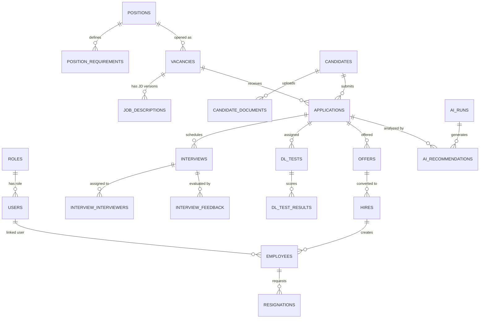

# 📊 เอกสารอธิบายโครงสร้างฐานข้อมูลระบบ HR AI Agent (Database Schema Explanation)

เอกสารฉบับนี้อธิบายรายละเอียดโครงสร้างตารางข้อมูลทั้งหมดในฐานข้อมูล **Supabase (PostgreSQL)** ของระบบ **HR AI Agent Recruitment & Selection Platform** โดยแจกแจงหน้าที่การเก็บข้อมูล กลไกการทำงาน และความสัมพันธ์ (Foreign Key Relationships) ของแต่ละตารางอย่างละเอียดและเข้าใจง่าย

---

## 📑 สารบัญ
1. [ภาพรวมสถาปัตยกรรมฐานข้อมูล (Database Overview)](#1-ภาพรวมสถาปัตยกรรมฐานข้อมูล-database-overview)
2. [แผนผังความสัมพันธ์ (Entity Relationship Diagram - ERD)](#2-แผนผังความสัมพันธ์-entity-relationship-diagram---erd)
3. [คำอธิบายเจาะลึกรายตาราง (Detailed Tables Explanation)](#3-คำอธิบายเจาะลึกรายตาราง-detailed-tables-explanation)
   - [กลุ่มที่ 1: ผู้ใช้งานและสิทธิ์ (Users & Roles)](#กลุ่มที่-1-ผู้ใช้งานและสิทธิ์-users--roles)
   - [กลุ่มที่ 2: พนักงานและการลาออก (Employees & Resignations)](#กลุ่มที่-2-พนักงานและการลาออก-employees--resignations)
   - [กลุ่มที่ 3: ตำแหน่งงานหลักและเกณฑ์คุณสมบัติ (Positions & Requirements)](#กลุ่มที่-3-ตำแหน่งงานหลักและเกณฑ์คุณสมบัติ-positions--requirements)
   - [กลุ่มที่ 4: การเปิดรับตำแหน่งและ Job Description (Vacancies & JDs)](#กลุ่มที่-4-การเปิดรับตำแหน่งและ-job-description-vacancies--jds)
   - [กลุ่มที่ 5: ผู้สมัครและเอกสารแนบ (Candidates & Documents)](#กลุ่มที่-5-ผู้สมัครและเอกสารแนบ-candidates--documents)
   - [กลุ่มที่ 6: ใบสมัครงาน (Applications — หัวใจหลักของระบบ)](#กลุ่มที่-6-ใบสมัครงาน-applications--หัวใจหลักของระบบ)
   - [กลุ่มที่ 7: การสัมภาษณ์และผลการประเมิน (Interviews & Feedback)](#กลุ่มที่-7-การสัมภาษณ์และผลการประเมิน-interviews--feedback)
   - [กลุ่มที่ 8: การทดสอบออนไลน์ (DL Tests & Results)](#กลุ่มที่-8-การทดสอบออนไลน์-dl-tests--results)
   - [กลุ่มที่ 9: ข้อเสนอจ้างงานและการรับเข้าทำงาน (Offers & Hires)](#กลุ่มที่-9-ข้อเสนอจ้างงานและการรับเข้าทำงาน-offers--hires)
   - [กลุ่มที่ 10: การแจ้งเตือน (Notifications)](#กลุ่มที่-10-การแจ้งเตือน-notifications)
   - [กลุ่มที่ 11: การประมวลผลและการตัดสินใจของ AI (AI Runs & Recommendations)](#กลุ่มที่-11-การประมวลผลและการตัดสินใจของ-ai-ai-runs--recommendations)
   - [กลุ่มที่ 12: ประวัติไทม์ไลน์และการตรวจสอบ (Workflow Events & Audit Logs)](#กลุ่มที่-12-ประวัติไทม์ไลน์และการตรวจสอบ-workflow-events--audit-logs)
4. [วงจรการไหลของข้อมูล (End-to-End Recruitment Data Flow)](#4-วงจรการไหลของข้อมูล-end-to-end-recruitment-data-flow)

---

## 1. ภาพรวมสถาปัตยกรรมฐานข้อมูล (Database Overview)
* **Database Engine:** PostgreSQL บน Cloud Platform (Supabase)
* **Primary Key Strategy:** ใช้เลขจำนวนเต็ม `BIGINT GENERATED BY DEFAULT AS IDENTITY` (`1, 2, 3...`) เพื่อประสิทธิภาพสูงสุดในการ Query, การเชื่อมโยง Index และความง่ายในการอ่าน/อ้างอิง
* **Internationalization (i18n):** รองรับสองภาษา (ไทย/อังกฤษ) ในระดับฟิลด์ เช่น `title` / `title_th`, `summary` / `summary_th`
* **JSONB Flexibility:** ใช้ฟิลด์ JSONB สำหรับข้อมูลกึ่งโครงสร้าง เช่น ทักษะ (Skills), ความรับผิดชอบ (Responsibilities), เกณฑ์การให้คะแนน (Scores)

---

## 2. แผนผังความสัมพันธ์ (Entity Relationship Diagram - ERD)



---

## 3. คำอธิบายเจาะลึกรายตาราง (Detailed Tables Explanation)

---

### กลุ่มที่ 1: ผู้ใช้งานและสิทธิ์ (Users & Roles)

#### 1. `roles` (บทบาทและสิทธิ์การใช้งาน)
* **หน้าที่:** จัดเก็บประเภทสิทธิ์ของผู้ใช้งานในระบบ
* **การทำงาน:** กำหนดว่าผู้ใช้งานแต่ละคนมีสิทธิ์เข้าถึงหน้าและฟังก์ชันใดได้บ้าง เช่น ผู้ดูแลระบบ HR, ผู้จัดการแผนก หรือกรรมการสัมภาษณ์
* **ฟิลด์สำคัญ:** `id`, `name` (`HR_ADMIN`, `HIRING_MANAGER`, `INTERVIEWER`, `CANDIDATE`), `description`
* **ความสัมพันธ์:**
  * เป็นตารางแม่ให้กับ `users.role_id` (1 Role มีได้หลาย User)

#### 2. `users` (ข้อมูลผู้ใช้งานระบบ HR)
* **หน้าที่:** จัดเก็บข้อมูลบัญชีผู้ใช้งานสำหรับเจ้าหน้าที่ HR, ผู้บริหาร และทีมงาน
* **การทำงาน:** ใช้สำหรับการเข้าสู่ระบบ (Login) ตรวจสอบสิทธิ์ และแสดงโปรไฟล์ผู้ล็อกอิน
* **ฟิลด์สำคัญ:** `id`, `email`, `name`, `name_th`, `role_id`, `department`, `avatar_url`, `is_active`
* **ความสัมพันธ์:**
  * เชื่อมโยงกับ `roles` (`role_id` -> `roles.id`)
  * ถูกอ้างอิงเป็นผู้สร้าง/ผู้อนุมัติใน `vacancies`, `job_descriptions`, `offers`, `interview_feedback`

---

### กลุ่มที่ 2: พนักงานและการลาออก (Employees & Resignations)

#### 3. `employees` (ข้อมูลพนักงานในองค์กร)
* **หน้าที่:** จัดเก็บข้อมูลพนักงานปัจจุบันของบริษัท
* **การทำงาน:** ใช้อ้างอิงประวัติการทำงาน แผนก ตำแหน่ง และระดับงานของพนักงาน
* **ฟิลด์สำคัญ:** `id`, `employee_code`, `first_name`, `last_name`, `email`, `department`, `position`, `status` (`ACTIVE`, `RESIGNED`)
* **ความสัมพันธ์:**
  * เชื่อมโยงกับ `users` (`user_id` -> `users.id`)
  * ถูกอ้างอิงโดย `resignations` (เมื่อพนักงานยื่นลาออก)
  * ถูกสร้างขึ้นใหม่จาก `hires` (เมื่อผู้สมัครได้รับการว่าจ้าง)

#### 4. `resignations` (ข้อมูลการลาออก)
* **หน้าที่:** บันทึกประวัติและคำขอการลาออกของพนักงาน
* **การทำงาน:** เป็นจุดเริ่มต้น (Trigger) ของการเปิดรับสมัครงานตำแหน่งทดแทน (Replacement Vacancy)
* **ฟิลด์สำคัญ:** `id`, `employee_id`, `resignation_date`, `last_working_date`, `reason`, `status` (`PENDING`, `APPROVED`)
* **ความสัมพันธ์:**
  * เชื่อมโยงกับ `employees` (`employee_id` -> `employees.id`)
  * เชื่อมโยงกับ `users` (`approved_by` -> `users.id`)

---

### กลุ่มที่ 3: ตำแหน่งงานหลักและเกณฑ์คุณสมบัติ (Positions & Requirements)

#### 5. `positions` (โครงสร้างตำแหน่งงานหลัก)
* **หน้าที่:** จัดเก็บโครงสร้างตำแหน่งงานมาตรฐานขององค์กร (Master Position Data)
* **การทำงาน:** เป็นแม่แบบ (Template) สำหรับนำไปเปิดประกาศรับสมัคร เช่น ตำแหน่ง "Senior AI Engineer" แผนก "Engineering"
* **ฟิลด์สำคัญ:** `id`, `title`, `title_th`, `department`, `department_th`, `level`, `report_to`, `responsibilities`, `qualifications`
* **ความสัมพันธ์:**
  * เป็นตารางแม่ให้กับ `vacancies.position_id`
  * เป็นตารางแม่ให้กับ `position_requirements.position_id`

#### 6. `position_requirements` (เกณฑ์คุณสมบัติเฉพาะด้าน)
* **หน้าที่:** กำหนดเกณฑ์ย่อยและน้ำหนักคะแนน (Weight) สำหรับแต่ละตำแหน่ง
* **การทำงาน:** AI จะนำเกณฑ์เหล่านี้ไปใช้คำนวณ Match Score กับประวัติของผู้สมัคร
* **ฟิลด์สำคัญ:** `id`, `position_id`, `requirement_type` (`EDUCATION`, `EXPERIENCE`, `SKILL`, `LANGUAGE`), `requirement_key`, `requirement_value`, `weight`
* **ความสัมพันธ์:**
  * เชื่อมโยงกับ `positions` (`position_id` -> `positions.id`)

---

### กลุ่มที่ 4: การเปิดรับตำแหน่งและ Job Description (Vacancies & JDs)

#### 7. `vacancies` (การเปิดรับสมัครงาน)
* **หน้าที่:** จัดเก็บข้อมูลรอบการเปิดรับสมัครงานจริงในแต่ละช่วงเวลา
* **การทำงาน:** ควบคุม State Machine ของตำแหน่งงาน:  
  `DRAFT` ➔ `WAITING_HR_APPROVAL` ➔ `APPROVED` ➔ `PUBLISHED` ➔ `RECRUITING` ➔ `INTERVIEWING` ➔ `OFFERING` ➔ `FILLED` ➔ `CLOSED`
* **ฟิลด์สำคัญ:** `id`, `position_id`, `state`, `priority`, `headcount`, `filled`, `reason` (`NEW_POSITION`, `REPLACEMENT`), `hiring_manager_id`
* **ความสัมพันธ์:**
  * เชื่อมโยงกับ `positions` (`position_id` -> `positions.id`)
  * เชื่อมโยงกับ `users` (`hiring_manager_id` -> `users.id`)
  * เป็นตารางแม่ให้กับ `job_descriptions` และ `applications`

#### 8. `job_descriptions` (คำบรรยายลักษณะงาน - JD)
* **หน้าที่:** จัดเก็บเนื้อหา Job Description ฉบับเต็มที่สร้างโดย Google Gemini AI หรือ HR ปรับแก้
* **การทำงาน:** รองรับการจัดเก็บหลายเวอร์ชัน (Versioning) เพื่อดูประวัติการแก้ไขและบันทึกว่า AI รุ่นใดเป็นผู้สร้าง
* **ฟิลด์สำคัญ:** `id`, `vacancy_id`, `version`, `job_title`, `summary_th`, `responsibilities_th`, `requirements_th`, `preferred_skills`, `benefits_th`, `generated_by_ai`, `ai_model_version`, `approved_by`
* **ความสัมพันธ์:**
  * เชื่อมโยงกับ `vacancies` (`vacancy_id` -> `vacancies.id`)

---

### กลุ่มที่ 5: ผู้สมัครและเอกสารแนบ (Candidates & Documents)

#### 9. `candidates` (ข้อมูลผู้สมัครงาน)
* **หน้าที่:** จัดเก็บประวัติส่วนตัว โปรไฟล์ ประสบการณ์ และทักษะของผู้สมัคร
* **การทำงาน:** ผู้สมัคร 1 คนสามารถมีโปรไฟล์เดียวในระบบ แต่สามารถยื่นสมัครได้หลายตำแหน่งงาน
* **ฟิลด์สำคัญ:** `id`, `first_name`, `last_name`, `email`, `phone`, `current_position`, `current_company`, `experience_years`, `skills`, `education`, `source`
* **ความสัมพันธ์:**
  * เป็นตารางแม่ให้กับ `candidate_documents` และ `applications`

#### 10. `candidate_documents` (เอกสารแนบของผู้สมัคร)
* **หน้าที่:** จัดเก็บไฟล์เอกสารทั้งหมดที่ผู้สมัครแนบมาในขั้นตอนการยื่นใบสมัคร
* **การทำงาน:** รองรับการแนบหลายไฟล์ (Multiple Files) พร้อมแยกหมวดหมู่เอกสารชัดเจน
* **ฟิลด์สำคัญ:** `id`, `candidate_id`, `document_type` (`RESUME`, `PORTFOLIO`, `CERTIFICATE`, `TRANSCRIPT`, `OTHER`), `file_name`, `file_url`, `file_size`, `mime_type`
* **ความสัมพันธ์:**
  * เชื่อมโยงกับ `candidates` (`candidate_id` -> `candidates.id`)

---

### กลุ่มที่ 6: ใบสมัครงาน (Applications — หัวใจหลักของระบบ)

#### 11. `applications` (ใบสมัครงาน)
* **หน้าที่:** ตารางหลักที่เชื่อมโยงระหว่าง **"ผู้สมัคร (Candidate)"** และ **"ตำแหน่งงานที่เปิดรับ (Vacancy)"**
* **การทำงาน:** ควบคุมขั้นตอนการคัดเลือก (Recruitment Pipeline):  
  `APPLIED` ➔ `AI_SCREENING` ➔ `HR_REVIEW` ➔ `SHORTLISTED` ➔ `INTERVIEW_INVITED` ➔ `INTERVIEW_CONFIRMED` ➔ `INTERVIEWED` ➔ `OFFERED` ➔ `HIRED` / `REJECTED`
* **ฟิลด์สำคัญ:** `id`, `candidate_id`, `vacancy_id`, `state`, `match_score`, `hr_notes`, `applied_at`
* **ความสัมพันธ์:**
  * เชื่อมโยงกับ `candidates` (`candidate_id` -> `candidates.id`)
  * เชื่อมโยงกับ `vacancies` (`vacancy_id` -> `vacancies.id`)
  * เป็นศูนย์กลางที่เชื่อมต่อไปยัง `interviews`, `dl_tests`, `offers`, และ `ai_recommendations`

---

### กลุ่มที่ 7: การสัมภาษณ์และผลการประเมิน (Interviews & Feedback)

#### 12. `interviews` (การนัดหมายสัมภาษณ์)
* **หน้าที่:** จัดเก็บตารางเวลานัดหมายการสัมภาษณ์ผู้สมัครแต่ละรอบ
* **การทำงาน:** แสดงในหน้าปฏิทินสัมภาษณ์ พร้อมลิงก์ห้องประชุมออนไลน์ (Google Meet/Zoom) หรือสถานที่นัดพบ
* **ฟิลด์สำคัญ:** `id`, `application_id`, `candidate_id`, `vacancy_id`, `interview_type` (`TECHNICAL`, `BEHAVIORAL`, `FINAL`), `status` (`SCHEDULED`, `CONFIRMED`, `COMPLETED`), `scheduled_at`, `duration`, `meeting_url`
* **ความสัมพันธ์:**
  * เชื่อมโยงกับ `applications`, `candidates`, และ `vacancies`
  * เป็นตารางแม่ให้กับ `interview_interviewers` และ `interview_feedback`

#### 13. `interview_interviewers` (กรรมการผู้สัมภาษณ์)
* **หน้าที่:** จัดเก็บรายชื่อกรรมการและ HR ที่ได้รับมอบหมายให้เข้าสัมภาษณ์ผู้สมัครในรอบนั้นๆ
* **ฟิลด์สำคัญ:** `id`, `interview_id`, `user_id`
* **ความสัมพันธ์:**
  * เชื่อมโยงกับ `interviews` (`interview_id` -> `interviews.id`)
  * เชื่อมโยงกับ `users` (`user_id` -> `users.id`)

#### 14. `interview_feedback` (ผลคะแนนการประเมินการสัมภาษณ์)
* **หน้าที่:** บันทึกคะแนน ความคิดเห็น จุดแข็ง และข้อกังวลจากกรรมการแต่ละท่าน
* **ฟิลด์สำคัญ:** `id`, `interview_id`, `interviewer_id`, `scores` (JSONB), `overall_score`, `strengths`, `concerns`, `recommendation` (`STRONG_HIRE`, `HIRE`, `HOLD`, `NO_HIRE`)
* **ความสัมพันธ์:**
  * เชื่อมโยงกับ `interviews` และ `users`

---

### กลุ่มที่ 8: การทดสอบออนไลน์ (DL Tests & Results)

#### 15. `dl_tests` (การมอบหมายแบบทดสอบทักษะดิจิทัล)
* **หน้าที่:** บันทึกรายการส่งแบบทดสอบออนไลน์ให้ผู้สมัครทำเพื่อวัดระดับความรู้
* **ฟิลด์สำคัญ:** `id`, `application_id`, `candidate_id`, `external_test_id`, `test_url`, `status` (`PENDING`, `COMPLETED`), `assigned_at`, `expires_at`
* **ความสัมพันธ์:**
  * เชื่อมโยงกับ `applications` และ `candidates`
  * เป็นตารางแม่ให้กับ `dl_test_results`

#### 16. `dl_test_results` (ผลคะแนนแบบทดสอบ)
* **หน้าที่:** จัดเก็บผลคะแนนที่ส่งกลับมาจากระบบทดสอบ
* **ฟิลด์สำคัญ:** `id`, `dl_test_id`, `knowledge_score`, `practical_score`, `ai_literacy_score`, `total_score`, `result_status` (`PASS`, `FAIL`)
* **ความสัมพันธ์:**
  * เชื่อมโยงกับ `dl_tests`, `candidates`, และ `applications`

---

### กลุ่มที่ 9: ข้อเสนอจ้างงานและการรับเข้าทำงาน (Offers & Hires)

#### 17. `offers` (หนังสือและข้อเสนอการจ้างงาน)
* **หน้าที่:** จัดเก็บรายละเอียดสัญญาจ้างงาน อัตราเงินเดือน วันเริ่มงาน และสวัสดิการ
* **ฟิลด์สำคัญ:** `id`, `application_id`, `candidate_id`, `vacancy_id`, `offered_salary`, `start_date`, `benefits`, `status` (`PENDING`, `ACCEPTED`, `REJECTED`)
* **ความสัมพันธ์:**
  * เชื่อมโยงกับ `applications`, `candidates`, `vacancies`, และ `users`

#### 18. `hires` (การบรรจุเป็นพนักงานใหม่)
* **หน้าที่:** บันทึกการตอบรับข้อเสนอ และส่งต่อข้อมูลไปยังระบบ Onboarding ของพนักงาน
* **ฟิลด์สำคัญ:** `id`, `offer_id`, `candidate_id`, `employee_id`, `start_date`, `onboarding_status` (`PENDING`, `COMPLETED`)
* **ความสัมพันธ์:**
  * เชื่อมโยงกับ `offers`, `candidates`, และ `employees`

---

### กลุ่มที่ 10: การแจ้งเตือน (Notifications)

#### 19. `notifications` (ระบบแจ้งเตือน)
* **หน้าที่:** จัดเก็บข้อความแจ้งเตือนสำหรับผู้ใช้งาน เช่น มีผู้สมัครใหม่, ถึงเวลานัดสัมภาษณ์, หรือผล AI คัดกรองเสร็จสิ้น
* **ฟิลด์สำคัญ:** `id`, `user_id`, `title_th`, `message_th`, `type` (`INFO`, `SUCCESS`, `WARNING`, `ACTION_REQUIRED`), `is_read`, `action_url`
* **ความสัมพันธ์:**
  * เชื่อมโยงกับ `users` (`user_id` -> `users.id`)

---

### กลุ่มที่ 11: การประมวลผลและการตัดสินใจของ AI (AI Runs & Recommendations)

#### 20. `ai_runs` (ประวัติการเรียกประมวลผลของ AI)
* **หน้าที่:** บันทึก Log การสั่งงาน AI Agent แต่ละครั้ง (Gemini 3.6 Flash / Pro)
* **ฟิลด์สำคัญ:** `id`, `agent_type` (`JD_GENERATOR`, `CANDIDATE_MATCHER`), `status`, `input` (JSONB), `output` (JSONB), `model_version`, `duration_ms`

#### 21. `ai_recommendations` (ผลการวิเคราะห์และคำแนะนำของ AI)
* **หน้าที่:** จัดเก็บผลคะแนนความเหมาะสม (Match Score), จุดแข็ง (Strengths), จุดที่ควรพัฒนา (Gaps), และคำตัดสิน (`SHORTLIST` / `HOLD`)
* **ฟิลด์สำคัญ:** `id`, `ai_run_id`, `application_id`, `candidate_id`, `vacancy_id`, `match_score`, `confidence`, `strengths_th`, `gaps_th`, `recommendation`, `reasoning_th`
* **ความสัมพันธ์:**
  * เชื่อมโยงกับ `ai_runs`, `applications`, `candidates`, และ `vacancies`

---

### กลุ่มที่ 12: ประวัติไทม์ไลน์และการตรวจสอบ (Workflow Events & Audit Logs)

#### 22. `workflow_events` (ไทม์ไลน์กิจกรรมของระบบ)
* **หน้าที่:** บันทึกทุกเหตุการณ์สำคัญที่เกิดขึ้นในกระบวนการสรรหา เพื่อนำไปแสดงผลเป็นประวัติไทม์ไลน์ (Activity Feed)
* **ฟิลด์สำคัญ:** `id`, `event_type`, `entity_type` (`VACANCY`, `APPLICATION`, `INTERVIEW`), `entity_id`, `actor_type` (`HR`, `AI_AGENT`, `CANDIDATE`), `description_th`

#### 23. `audit_logs` (บันทึกความปลอดภัยและตรวจสอบย้อนหลัง)
* **หน้าที่:** บันทึกการเปลี่ยนแปลงข้อมูลเพื่อความปลอดภัยและมาตรฐานความถูกต้อง (Compliance)
* **ฟิลด์สำคัญ:** `id`, `user_id`, `action`, `entity_type`, `old_values`, `new_values`, `ip_address`, `created_at`

---

## 4. วงจรการไหลของข้อมูล (End-to-End Recruitment Data Flow)

```
[1. สร้างตำแหน่งงาน]
HR/Manager สร้างข้อมูลตำแหน่ง ➔ บันทึกลง vacancies + positions ➔ เรียก Gemini AI ร่าง JD บันทึกลง job_descriptions
                         │
                         ▼
[2. อนุมัติ & ประกาศรับสมัคร]
HR กดอนุมัติ JD ➔ vacancies.state = 'PUBLISHED' ➔ ข้อมูลแสดงในหน้า Career Portal (/jobs)
                         │
                         ▼
[3. ผู้สมัครยื่นใบสมัคร]
ผู้สมัครกรอกข้อมูล & แนบไฟล์ ➔ candidates + candidate_documents + applications (state = 'APPLIED')
                         │
                         ▼
[4. AI ทำการคัดกรองอัตโนมัติ]
Gemini 3.6 Flash วิเคราะห์ประวัติเทียบกับ JD ➔ บันทึกลง ai_recommendations + อัปเดต applications.match_score
                         │
                         ▼
[5. นัดหมายสัมภาษณ์]
HR กด "เชิญสัมภาษณ์" ➔ บันทึกลง interviews ➔ ตารางนัดหมายปรากฏในหน้า /dashboard/interviews
                         │
                         ▼
[6. ประเมินผลสัมภาษณ์]
กรรมการกรอกคะแนน ➔ บันทึกลง interview_feedback ➔ applications.state = 'SHORTLISTED'
                         │
                         ▼
[7. ส่งข้อเสนอจ้าง & รับเข้าทำงาน]
HR ส่ง Offer ➔ offers ➔ ผู้สมัครตอบรับ ➔ hires ➔ บันทึกเป็นพนักงานใหม่ใน employees สำเร็จ! 🎉
```
