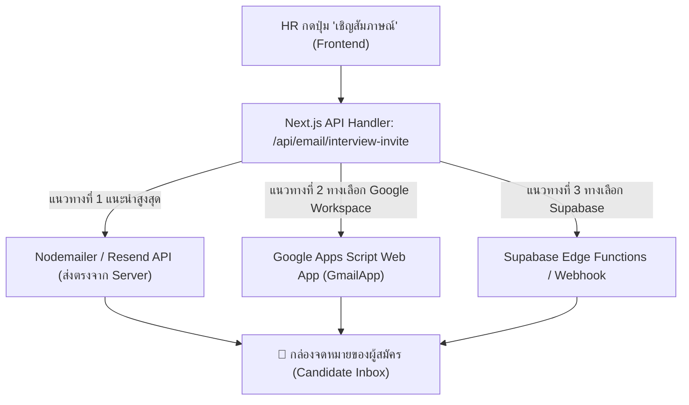

# 📧 คู่มือและแนวทางการพัฒนาระบบส่งอีเมลเชิญสัมภาษณ์อัตโนมัติ (Automated Interview Invitation Email System)

เอกสารนี้จัดทำขึ้นเพื่ออธิบายเครื่องมือ สถาปัตยกรรม และแนวทางการพัฒนาระบบ **ส่งอีเมลแจ้งเตือนผู้สมัครอัตโนมัติเมื่อ HR คลิกปุ่ม "เชิญสัมภาษณ์"** ให้กับระบบ **HR AI Agent Recruitment System**

---

## 📌 สรุปคำตอบสำคัญ

### 1. ต้องใช้เครื่องมืออะไรบ้าง?
เครื่องมือที่ใช้จะแบ่งเป็น 3 องค์ประกอบหลัก:
1. **Frontend Trigger:** ปุ่ม "เชิญสัมภาษณ์" บนหน้าเว็บ (`/dashboard/applications/[id]` หรือ Modal นัดสัมภาษณ์) ที่ดึงอีเมลและชื่อผู้สมัครมาส่งให้ API
2. **Backend API Handler:** Next.js Route Handler (`/api/email/interview-invite`) สำหรับรับข้อมูลและสั่งส่งอีเมล
3. **Email Delivery Provider / Service:** บริการส่งอีเมล (เช่น **Nodemailer**, **Resend**, หรือ **Google Apps Script**)

### 2. จำเป็นต้องเขียน Google Apps Script ร่วมด้วยหรือไม่?
> **คำตอบ: ไม่จำเป็นต้องใช้ Google Apps Script ก็สามารถทำได้ครับ** 
> 
> ใน Next.js เราสามารถติดตั้งไลบรารีอย่าง **`nodemailer`** หรือ **`resend`** แล้วส่งตรงจากระบบได้ทันที ซึ่งเป็นวิธีมาตรฐานที่นักพัฒนานิยมใช้มากที่สุด **แต่ถ้าคุณมี Google Workspace ของมหาวิทยาลัย/องค์กร และต้องการใช้ Gmail ส่งฟรีโดยไม่ต้องสมัครบริการภายนอก การใช้ Google Apps Script ก็เป็นอีกหนึ่งตัวเลือกที่ดีมากครับ**

---

## 🏗️ 3 แนวทางการพัฒนาและเปรียบเทียบเครื่องมือ



---

### 🌟 แนวทางที่ 1: ใช้ `Nodemailer` หรือ `Resend` ใน Next.js (⭐ แนะนำสูงสุด)

แนวทางนี้เป็นแนวทางมาตรฐานของการพัฒนาเว็บแอปพลิเคชันยุคใหม่ เพราะโค้ดทุกอย่างเขียนและควบคุมอยู่ภายในโปรเจกต์ Next.js จบในที่เดียว ไม่ต้องมี Server ภายนอก

* **เครื่องมือที่ใช้:**
  * ไลบรารี: `nodemailer` หรือ `resend` (ติดตั้งผ่าน `npm install nodemailer` หรือ `npm install resend`)
  * SMTP Provider: สามารถใช้ Gmail App Password ของคุณ, Office 365, หรือ Resend API (ฟรี 3,000 อีเมล/เดือน)
* **ข้อดี:**
  * ⚡ **เร็วที่สุดและเสถียรที่สุด:** ส่งอีเมลได้ภายใน 1-2 วินาทีหลังจากกดปุ่ม
  * 🎨 **สร้างเทมเพลตอีเมลสวยงามระดับพรีเมียม (HTML Responsive):** จัดใส่โลโก้ ม.ศรีปทุม, กล่องรายละเอียดวัน/เวลา/สถานที่, และปุ่มกดเข้าห้อง Google Meet
  * 🔒 **ปลอดภัย:** เก็บ Credentials ใน `.env.local`
  * 🛠️ **ไม่ต้องสลับไปเขียนระบบอื่น:** โค้ดทั้งหมดอยู่ในโฟลเดอร์ `src/app/api/email/`

---

### 📑 แนวทางที่ 2: ใช้ `Google Apps Script` เป็น Webhook ส่งผ่าน Gmail

แนวทางนี้เหมาะสำหรับผู้ที่ต้องการใช้อีเมล `@spu.ac.th` หรือ `@gmail.com` ขององค์กรส่งออก โดยเขียน Apps Script สั้นๆ เป็นตัวรับข้อมูล (Webhook) แล้วใช้คำสั่ง `GmailApp.sendEmail()`

* **เครื่องมือที่ใช้:**
  * Google Apps Script (สร้างใน Google Drive) เผยแพร่เป็น **Web App**
  * Next.js ส่ง `fetch('https://script.google.com/macros/s/.../exec', { method: 'POST', body: ... })`
* **ข้อดี:**
  * 🆓 **ฟรี 100%:** ใช้อีเมล Google ของคุณส่งได้วันละ 100 - 1,500 ฉบับ
  * 📧 **ส่งในนามอีเมลจริงของผู้ใช้:** ผู้สมัครจะเห็นว่าส่งมาจากอีเมลของ HR หรือมหาวิทยาลัยโดยตรง
* **ข้อจำกัด:**
  * ต้องสร้างและ Deploy Web App บน Google Drive เพิ่มเติม 1 จุด
  * การตอบสนองช้ากว่าแนวทางที่ 1 เล็กน้อย (ประมาณ 2-4 วินาที)

---

### ⚡ แนวทางที่ 3: ใช้ `Supabase Database Webhook / Edge Functions`

แนวทางนี้ทำงานผ่านฐานข้อมูล เมื่อสถานะของ Application เปลี่ยนเป็น `INTERVIEW_INVITED` ฐานข้อมูล Supabase จะสั่ง Trigger ส่งอีเมลทันที

* **เครื่องมือที่ใช้:** Supabase Edge Functions + Resend
* **ข้อดี:** ทำงานอัตโนมัติที่ระดับ Database

---

## 🛠️ ขั้นตอนการพัฒนาจริง (Step-by-Step Implementation)

### ขั้นตอนที่ 1: ออกแบบหน้าต่างและ Event เมื่อ HR คลิก "เชิญสัมภาษณ์"
ในหน้า `/dashboard/applications/[id]` หรือในตารางการสัมภาษณ์ เมื่อ HR คลิกปุ่ม **"เชิญสัมภาษณ์ (Invite to Interview)"**:
1. เปิด Modal ให้ระบุ **วัน-เวลาสัมภาษณ์**, **รอบการสัมภาษณ์**, และ **ลิงก์ Google Meet / ห้องสัมภาษณ์**
2. เมื่อกดปุ่มยืนยัน ระบบจะยิงคำขอไปที่ `/api/email/interview-invite` พร้อมส่ง Payload:
```json
{
  "candidateEmail": "mmatha11637@gmail.com",
  "candidateName": "Phanloed Phiphatsukphinyo",
  "positionTitle": "Senior E-Learning System Administrator",
  "interviewDate": "วันจันทร์ที่ 7 กันยายน 2026",
  "interviewTime": "14:00 - 15:00 น.",
  "interviewType": "สัมภาษณ์เชิงเทคนิค (Technical Interview)",
  "locationType": "ONLINE",
  "meetingUrl": "https://meet.google.com/spu-hr-interview",
  "location": "อาคาร 11 ชั้น 8 มหาวิทยาลัยศรีปทุม (บางเขน)"
}
```

---

### ขั้นตอนที่ 2: ตัวอย่างโค้ด Next.js Backend Route (`src/app/api/email/interview-invite/route.ts`)

```typescript
import { NextRequest, NextResponse } from 'next/server';
import nodemailer from 'nodemailer';

export async function POST(request: NextRequest) {
  try {
    const data = await request.json();
    const {
      candidateEmail,
      candidateName,
      positionTitle,
      interviewDate,
      interviewTime,
      interviewType,
      locationType,
      meetingUrl,
      location,
    } = data;

    // 1. ตั้งค่า Mail Transporter (เช่น Gmail SMTP หรือ SMTP องค์กร)
    const transporter = nodemailer.createTransport({
      service: 'gmail',
      auth: {
        user: process.env.SMTP_EMAIL, // อีเมลผู้ส่ง เช่น hr@company.com
        pass: process.env.SMTP_PASSWORD, // App Password จาก Google Account
      },
    });

    // 2. ออกแบบเทมเพลต HTML Email สวยงามพร้อมปุ่มกด
    const htmlContent = `
      <div style="font-family: 'Segoe UI', Tahoma, Geneva, Verdana, sans-serif; max-width: 600px; margin: 0 auto; background-color: #ffffff; border-radius: 16px; overflow: hidden; border: 1px solid #fce7f3;">
        <div style="background: linear-gradient(135deg, #f43f5e 0%, #ec4899 100%); padding: 32px 24px; text-align: center; color: #ffffff;">
          <h1 style="margin: 0; font-size: 22px; font-weight: 800; letter-spacing: 0.5px;">HR AI AGENT</h1>
          <p style="margin: 6px 0 0 0; font-size: 13px; opacity: 0.9;">มหาวิทยาลัยศรีปทุม (Sripatum University)</p>
        </div>
        
        <div style="padding: 32px 24px; color: #1e293b;">
          <h2 style="font-size: 18px; font-weight: bold; color: #0f172a; margin-top: 0;">
            เรียน คุณ ${candidateName},
          </h2>
          <p style="font-size: 14px; line-height: 1.6; color: #475569;">
            ทางฝ่ายสรรหาและพัฒนาทรัพยากรบุคคล มีความยินดีที่จะแจ้งให้ทราบว่า 
            <strong style="color: #f43f5e;">"คุณได้รับเลือกให้เข้ารับการสัมภาษณ์"</strong> 
            สำหรับตำแหน่งงาน <strong>${positionTitle}</strong>
          </p>

          <!-- กล่องสรุปเวลานัดหมาย -->
          <div style="background-color: #fff5f7; border: 1px solid #fecdd3; border-radius: 12px; padding: 20px; margin: 24px 0;">
            <h3 style="margin: 0 0 12px 0; font-size: 14px; font-weight: bold; color: #9f1239;">
              📅 รายละเอียดการนัดหมายสัมภาษณ์
            </h3>
            <table style="width: 100%; font-size: 13px; color: #334155; line-height: 1.8;">
              <tr>
                <td style="width: 120px; font-weight: bold; color: #64748b;">วันที่:</td>
                <td><strong>${interviewDate}</strong></td>
              </tr>
              <tr>
                <td style="font-weight: bold; color: #64748b;">เวลา:</td>
                <td><strong>${interviewTime}</strong></td>
              </tr>
              <tr>
                <td style="font-weight: bold; color: #64748b;">รูปแบบ:</td>
                <td>${interviewType} (${locationType === 'ONLINE' ? 'ออนไลน์' : 'ณ สถานที่'})</td>
              </tr>
              <tr>
                <td style="font-weight: bold; color: #64748b;">สถานที่/ลิงก์:</td>
                <td>${locationType === 'ONLINE' ? 'Google Meet' : location}</td>
              </tr>
            </table>
          </div>

          ${locationType === 'ONLINE' && meetingUrl ? `
            <div style="text-align: center; margin: 30px 0;">
              <a href="${meetingUrl}" style="background: linear-gradient(135deg, #f43f5e 0%, #ec4899 100%); color: #ffffff; text-decoration: none; padding: 12px 28px; border-radius: 10px; font-size: 14px; font-weight: bold; display: inline-block;">
                🔗 เข้าร่วมห้องสัมภาษณ์ (Google Meet)
              </a>
            </div>
          ` : ''}

          <p style="font-size: 12px; color: #64748b; line-height: 1.5;">
            * หากท่านไม่สะดวกในวันและเวลาดังกล่าว สามารถติดต่อกลับฝ่ายทรัพยากรบุคคลเพื่อประสานงานขอเลื่อนนัดหมายได้ล่วงหน้า
          </p>
        </div>

        <div style="background-color: #f8fafc; border-top: 1px solid #f1f5f9; padding: 16px 24px; text-align: center; font-size: 11px; color: #94a3b8;">
          อีเมลนี้เป็นข้อความอัตโนมัติจากระบบ HR AI Agent Recruitment System
        </div>
      </div>
    `;

    // 3. สั่งส่งอีเมล
    await transporter.sendMail({
      from: `"ฝ่ายสรรหาบุคลากร (HR Recruitment)" <${process.env.SMTP_EMAIL}>`,
      to: candidateEmail,
      subject: `[แจ้งผลการคัดเลือก] ขอเรียนเชิญเข้ารับการสัมภาษณ์งานตำแหน่ง ${positionTitle} — มหาวิทยาลัยศรีปทุม`,
      html: htmlContent,
    });

    return NextResponse.json({ success: true });
  } catch (error: any) {
    console.error('Email send error:', error);
    return NextResponse.json({ error: error.message || 'Failed to send email' }, { status: 500 });
  }
}
```

---

### ขั้นตอนที่ 3: (ทางเลือกเสริม) ตัวอย่างโค้ด Google Apps Script

หากเลือกใช้ **Google Apps Script**:
1. ไปที่ [script.google.com](https://script.google.com) ➔ สร้างโปรเจกต์ใหม่
2. วางโค้ดนี้:
```javascript
function doPost(e) {
  try {
    var data = JSON.parse(e.postData.contents);
    var candidateEmail = data.candidateEmail;
    var candidateName = data.candidateName;
    var positionTitle = data.positionTitle;
    var interviewDate = data.interviewDate;
    var interviewTime = data.interviewTime;
    var meetingUrl = data.meetingUrl || "";

    var subject = "[แจ้งผลการคัดเลือก] ขอเรียนเชิญเข้ารับการสัมภาษณ์งานตำแหน่ง " + positionTitle;
    var body = "เรียน คุณ " + candidateName + ",\n\n" +
               "คุณได้รับเลือกให้เข้ารับการสัมภาษณ์ในตำแหน่ง " + positionTitle + "\n" +
               "วันสัมภาษณ์: " + interviewDate + " เวลา " + interviewTime + "\n" +
               "ลิงก์การสัมภาษณ์: " + meetingUrl + "\n\n" +
               "ฝ่ายทรัพยากรบุคคล มหาวิทยาลัยศรีปทุม";

    GmailApp.sendEmail(candidateEmail, subject, body, {
      name: "ฝ่ายสรรหาบุคลากร SPU HR"
    });

    return ContentService.createTextOutput(JSON.stringify({ success: true }))
      .setMimeType(ContentService.MimeType.JSON);
  } catch (err) {
    return ContentService.createTextOutput(JSON.stringify({ error: err.message }))
      .setMimeType(ContentService.MimeType.JSON);
  }
}
```
3. กด **Deploy ➔ New Deployment ➔ Web App** (เลือก Anyone has access)
4. นำ Web App URL ที่ได้มาใส่ในโปรเจกต์ Next.js

---

## 📊 ตารางสรุปเปรียบเทียบแนวทาง

| คุณสมบัติ | แนวทางที่ 1: Nodemailer / Resend (แนะนำ) | แนวทางที่ 2: Google Apps Script | แนวทางที่ 3: Supabase Function |
| :--- | :--- | :--- | :--- |
| **ความสะดวกในการดูแลระบบ** | ⭐⭐⭐⭐⭐ (อยู่ในโปรเจกต์ 100%) | ⭐⭐⭐ (ต้องดูแลไฟล์บน Google Drive แยก) | ⭐⭐⭐⭐ (ผ่าน Supabase Dashboard) |
| **ความสวยงามของอีเมล** | ⭐⭐⭐⭐⭐ (Responsive HTML + Button) | ⭐⭐⭐ (Text / HTML พื้นฐาน) | ⭐⭐⭐⭐⭐ (HTML Template) |
| **ค่าใช้จ่าย** | 🆓 ฟรี (ผ่าน Gmail SMTP หรือ Resend Free Tier) | 🆓 ฟรี 100% | 🆓 ฟรี (Free Tier) |
| **ความเร็วในการส่ง** | ⚡ เร็วมาก (1-2 วินาที) | ⏱️ ปานกลาง (2-4 วินาที) | ⚡ เร็วมาก |
| **เหมาะกับกรณี** | **ระบบเว็บเต็มรูปแบบที่ต้องการความเสถียร** | ผู้ที่ต้องการส่งผ่าน Gmail โดยไม่ตั้งค่า SMTP | ต้องการ Trigger จาก Database |

---

## 🚀 ข้อแนะนำในการเริ่มพัฒนาทันที
หากคุณต้องการให้เริ่มพัฒนาในระบบนี้:
1. เราสามารถติดตั้ง `nodemailer` ในโปรเจกต์
2. สร้าง Endpoint `/api/email/interview-invite` พร้อมเทมเพลตสีชมพู SPU สวยงาม
3. เชื่อมปุ่ม **"เชิญสัมภาษณ์"** ในหน้าใบสมัคร (`/dashboard/applications/[id]`) ให้ยิงส่งอีเมลแจ้งเตือนถึงผู้สมัครจริงทันทีที่มีการคลิกครับ!
