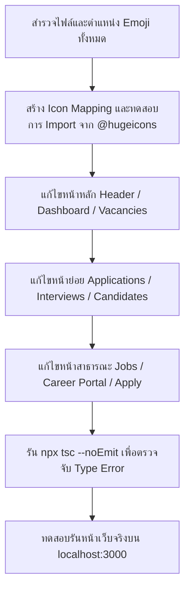

# 🎨 แผนการแปลงไอคอน Emoji ทั้งระบบสู่ Hugeicons Component (Complete Emoji Migration Guide)

---

## 📌 1. บทสรุปและความเป็นไปได้ (Feasibility & Assessment)

> [!IMPORTANT]
> **ทำได้ 100% และขอแนะนำอย่างยิ่งครับ!**  
> การเปลี่ยนจาก **Emoji (`🤖`, `📋`, `💼`, `📅`, ฯลฯ)** ไปเป็น **SVG Component ของ Hugeicons (`<HugeiconsIcon icon={...} />`)** จะช่วยยกระดับระบบ **HR AI Agent & Recruitment Workspace** ให้กลายเป็นระดับ **Enterprise-grade Web Application** โดยมีข้อดีหลักดังนี้:
> 1. **ความคมชัดและสม่ำเสมอ (Visual Consistency):** ทุกระบบปฏิบัติการ (Windows, macOS, iOS, Android) จะแสดงผลไอคอนเหมือนกัน 100% ไม่เพี้ยนตามฟอนต์ Emoji ประจำเครื่อง
> 2. **การปรับแต่งสีและขนาด (Styling & Theming):** สามารถใส่ Tailwind CSS classes เช่น `text-emerald-600`, `hover:text-emerald-700`, `animate-spin`, `shadow-xs` ได้อย่างอิสระ
> 3. **รองรับ Dark / Light Mode:** ไอคอน SVG จะเปลี่ยนสีตามธีมของหน้าจอได้อย่างแนบเนียน

---

## 🗺️ 2. ตารางเทียบเคียง Emoji ➔ Hugeicons Component (Emoji Mapping Catalog)

ตารางแสดงการจับคู่อีโมจิเดิมที่ใช้งานอยู่ในระบบ กับไอคอนใน `@hugeicons/core-free-icons` ที่มีความหมายและรูปร่างเทียบเคียงตรงกันที่สุด:

| หมวดหมู่ (Category) | Emoji เดิม | ไอคอน Hugeicons ที่เทียบเคียง | Import ชื่อ Component | ตัวอย่างโค้ดใช้งาน |
| :--- | :---: | :--- | :--- | :--- |
| **ระบบ AI & อัจฉริยะ** | `🤖` | ChatBot / AI Robot | `ChatBotIcon` | `<HugeiconsIcon icon={ChatBotIcon} size={16} />` |
| **ตำแหน่งงาน / อาชีพ** | `💼` | Briefcase / Bag | `Briefcase02Icon` / `Briefcase06Icon` | `<HugeiconsIcon icon={Briefcase06Icon} size={16} />` |
| **ใบสมัคร / แบบประเมิน** | `📝` / `📋` | Assignment / Quiz / Task | `AssignmentsIcon` / `Quiz03Icon` / `Task01Icon` | `<HugeiconsIcon icon={Quiz03Icon} size={15} />` |
| **ปฏิทิน / นัดหมาย** | `📅` / `🗓️` | Calendar | `Calendar03Icon` / `Calendar04Icon` | `<HugeiconsIcon icon={Calendar03Icon} size={16} />` |
| **ผลสำเร็จ / ตรวจสอบ** | `✅` / `✓` | Checkmark Square / Circle | `CheckmarkSquare01Icon` / `CheckmarkCircle01Icon` | `<HugeiconsIcon icon={CheckmarkSquare01Icon} size={16} />` |
| **การแจ้งเตือน** | `🔔` / `📢` | Notification Bell / Megaphone | `Notification01Icon` / `Megaphone01Icon` | `<HugeiconsIcon icon={Notification01Icon} size={16} />` |
| **รีโหลด / วนซ้ำ** | `🔄` | Reload / Refresh | `ReloadIcon` / `RefreshIcon` | `<HugeiconsIcon icon={ReloadIcon} size={14} />` |
| **ออกจากระบบ / ลาออก** | `🚪` / `🔴` | Logout / Exit | `LogOutIcon` / `Logout01Icon` | `<HugeiconsIcon icon={LogOutIcon} size={14} />` |
| **ค้นหาข้อมูล** | `🔍` | Search Loupe | `Search01Icon` | `<HugeiconsIcon icon={Search01Icon} size={16} />` |
| **องค์กร / ตึกสำนักงาน** | `🏢` | Office Building | `Building05Icon` | `<HugeiconsIcon icon={Building05Icon} size={16} />` |
| **สถานที่ / แผนที่** | `📍` | Location Pin | `Location01Icon` / `PinIcon` | `<HugeiconsIcon icon={Location01Icon} size={16} />` |
| **ผู้ใช้งาน / พนักงาน** | `👤` / `👥` | User / User Group | `User03Icon` / `UserGroupIcon` | `<HugeiconsIcon icon={User03Icon} size={16} />` |
| **คะแนน / ศักยภาพสูง** | `⭐` / `✨` | Star / Sparkles | `StarIcon` / `SparklesIcon` | `<HugeiconsIcon icon={StarIcon} size={16} />` |
| **เป้าหมาย / เกณฑ์** | `🎯` | Target / Goal | `Target01Icon` / `Target02Icon` | `<HugeiconsIcon icon={Target01Icon} size={16} />` |
| **คำเตือน / สำคัญ** | `⚠️` | Alert Triangle / Warning | `Alert02Icon` / `AlertCircleIcon` | `<HugeiconsIcon icon={Alert02Icon} size={16} />` |
| **ความผิดพลาด / ปิด** | `❌` / `✕` | Cancel / Close Cross | `Cancel01Icon` / `MultiplicationSignIcon` | `<HugeiconsIcon icon={Cancel01Icon} size={14} />` |
| **บันทึกข้อมูล** | `💾` | Floppy Disk / Save | `FloppyDiskIcon` / `Save01Icon` | `<HugeiconsIcon icon={FloppyDiskIcon} size={15} />` |
| **กล่องข้อความว่าง** | `📭` | Mailbox Empty / Inbox | `Mailbox01Icon` / `Inbox01Icon` | `<HugeiconsIcon icon={Mailbox01Icon} size={32} />` |
| **ทักษะ / ความคิด** | `💡` | Lightbulb / Idea | `Idea01Icon` / `BulbIcon` | `<HugeiconsIcon icon={Idea01Icon} size={16} />` |
| **สวัสดิการ / ของขวัญ** | `🎁` | Gift / Present | `GiftIcon` | `<HugeiconsIcon icon={GiftIcon} size={16} />` |
| **เร่งด่วน / ไฟแรง** | `🔥` | Fire / Flame | `FireIcon` | `<HugeiconsIcon icon={FireIcon} size={15} />` |
| **ความปลอดภัย / ล็อค** | `🔒` / `🔐` | Lock / Security Key | `LockKeyIcon` / `SecurityLockIcon` | `<HugeiconsIcon icon={LockKeyIcon} size={16} />` |
| **ระบบอัตโนมัติ / เร็ว** | `⚡` | Flash / Bolt | `FlashIcon` | `<HugeiconsIcon icon={FlashIcon} size={14} />` |
| **ตั้งค่าระบบ** | `⚙️` | Settings Gear | `Settings01Icon` | `<HugeiconsIcon icon={Settings01Icon} size={16} />` |

---

## 📂 3. การแจกแจงแยกตามไฟล์ในระบบ (Source Code File Breakdown)

### 1. **ส่วน Header & Navigation (`src/pagefront/layout/Header.tsx`)**
* `🔔` ➔ `<HugeiconsIcon icon={Notification01Icon} />` (กระดิ่งแจ้งเตือน)
* `📭` ➔ `<HugeiconsIcon icon={Mailbox01Icon} />` (สถานะไม่มีการแจ้งเตือน)
* `⚡` ➔ `<HugeiconsIcon icon={FlashIcon} />` (ระบบ Sync เรียลไทม์)
* `👤` ➔ `<HugeiconsIcon icon={User03Icon} />` (เมนูโปรไฟล์)
* `⚙️` ➔ `<HugeiconsIcon icon={Settings01Icon} />` (เมนูตั้งค่า)
* `🚪` ➔ `<HugeiconsIcon icon={LogOutIcon} />` (เมนูออกจากระบบ)
* `✓` ➔ `<HugeiconsIcon icon={CheckmarkSquare01Icon} />` (อ่านทั้งหมด)

### 2. **หน้ารายการตำแหน่งงาน (`src/app/dashboard/vacancies/page.tsx` & `[id]/page.tsx`)**
* `✕` / `✕ ปิด` ➔ `<HugeiconsIcon icon={Cancel01Icon} />` (ปุ่มปิด Modal)
* `💼 ดูรายละเอียดตำแหน่งงานนี้` ➔ `<HugeiconsIcon icon={Briefcase06Icon} />`
* `📝 รายละเอียดตำแหน่งงาน & Job Description` ➔ `<HugeiconsIcon icon={AssignmentsIcon} />`
* `💾 บันทึก Job Description` ➔ `<HugeiconsIcon icon={FloppyDiskIcon} />`
* `✨ ให้ Gemini ร่าง JD ใหม่` ➔ `<HugeiconsIcon icon={SparklesIcon} />`
* `✦` จุดหัวข้อ ➔ `<HugeiconsIcon icon={SparklesIcon} size={10} />`

### 3. **หน้ารายการสัมภาษณ์ (`src/app/dashboard/interviews/page.tsx`)**
* `🗓️` ➔ `<HugeiconsIcon icon={Calendar03Icon} />` (การ์ดสถิติตารางสัมภาษณ์)
* `💾 บันทึกการเลื่อนนัดหมาย` ➔ `<HugeiconsIcon icon={FloppyDiskIcon} />`
* `⏰ เวลาสัมภาษณ์` ➔ `<HugeiconsIcon icon={Clock01Icon} />`

### 4. **หน้าจัดการใบสมัคร (`src/app/dashboard/applications/` & `[id]/page.tsx`)**
* `🎯 คะแนน AI Match` ➔ `<HugeiconsIcon icon={Target01Icon} />`
* `✅ Match` / `⚠️ Partial` / `❌ No Match` ➔ `<HugeiconsIcon icon={CheckmarkCircle01Icon} />` / `<HugeiconsIcon icon={Alert02Icon} />` / `<HugeiconsIcon icon={Cancel01Icon} />`
* `💡 คำแนะนำเพิ่มเติม` ➔ `<HugeiconsIcon icon={Idea01Icon} />`

### 5. **หน้า Career Portal & รายละเอียดตำแหน่งงาน (`src/app/jobs/` & `[id]/page.tsx`)**
* `🔐 สำหรับเจ้าหน้าที่ HR` ➔ `<HugeiconsIcon icon={LockKeyIcon} />`
* `🏢 คณะ / สำนัก` ➔ `<HugeiconsIcon icon={Building05Icon} />`
* `📍 สถานที่ทำงาน` ➔ `<HugeiconsIcon icon={Location01Icon} />`
* `💼 รูปแบบการทำงาน` ➔ `<HugeiconsIcon icon={Briefcase06Icon} />`
* `👥 จำนวนอัตราที่เปิดรับ` ➔ `<HugeiconsIcon icon={UserGroupIcon} />`
* `🔥 เร่งด่วน (Urgent)` ➔ `<HugeiconsIcon icon={FireIcon} />`
* `📋 หน้าที่ความรับผิดชอบ` ➔ `<HugeiconsIcon icon={AssignmentsIcon} />`
* `🎯 คุณสมบัติที่ต้องการ` ➔ `<HugeiconsIcon icon={Target01Icon} />`
* `💡 ทักษะที่ต้องการ` ➔ `<HugeiconsIcon icon={Idea01Icon} />`
* `🎁 สวัสดิการ` ➔ `<HugeiconsIcon icon={GiftIcon} />`

---

## 🛠️ 4. ขั้นตอนการลงมือแปลงโค้ด (Step-by-Step Implementation Workflow)



---

## 💻 5. โค้ดตัวอย่างเปรียบเทียบ (Before vs After)

### ก่อนแก้ (Emoji-based):
```tsx
<button className="flex items-center gap-1">
  <span>💼</span> ดูตำแหน่งงานทั้งหมด
</button>

<div className="flex items-center gap-2">
  <span>📍</span> Bangkok, Thailand
  <span>👥</span> 2 อัตรา
  <span>🔥</span> เร่งด่วน
</div>
```

### หลังแก้ (Hugeicons Component):
```tsx
import { HugeiconsIcon } from '@hugeicons/react';
import { 
  Briefcase06Icon, 
  Location01Icon, 
  UserGroupIcon, 
  FireIcon 
} from '@hugeicons/core-free-icons';

<button className="flex items-center gap-1.5 hover:text-emerald-700 font-semibold">
  <HugeiconsIcon icon={Briefcase06Icon} size={16} className="text-emerald-600" />
  <span>ดูตำแหน่งงานทั้งหมด</span>
</button>

<div className="flex items-center gap-3 text-xs text-slate-500 font-medium">
  <span className="inline-flex items-center gap-1">
    <HugeiconsIcon icon={Location01Icon} size={14} className="text-slate-400" />
    Bangkok, Thailand
  </span>
  <span className="inline-flex items-center gap-1">
    <HugeiconsIcon icon={UserGroupIcon} size={14} className="text-slate-400" />
    2 อัตรา
  </span>
  <span className="inline-flex items-center gap-1 text-rose-600 font-bold bg-rose-50 px-2 py-0.5 rounded-full border border-rose-200">
    <HugeiconsIcon icon={FireIcon} size={13} className="text-rose-500" />
    เร่งด่วน
  </span>
</div>
```

---

## 🎯 6. สรุปความพร้อม

ไฟล์เอกสารนี้ถูกจัดเก็บไว้ที่:  
📁 [**`document/EMOJI_TO_HUGEICONS_MIGRATION_PLAN.md`**](file:///c:/Users/iceor/Downloads/งานเมยฺ์เอง/HR_Agent/hr-ai-agent/document/EMOJI_TO_HUGEICONS_MIGRATION_PLAN.md)

คุณสามารถยืนยันให้เริ่มดำเนินการแปลง Emoji เป็น Hugeicons ได้ทันทีครับ โดยระบบจะทยอยแปลงทีละโมดูลพร้อมตรวจสอบความถูกต้องอย่างละเอียด 100%! 🚀
