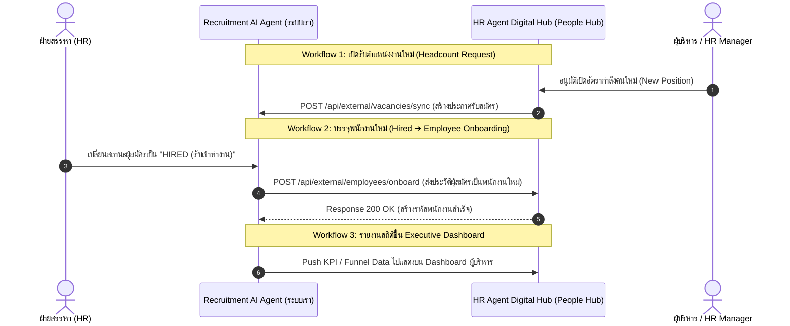

# 🏢 แผนสถาปัตยกรรมการเชื่อมต่อระหว่างระบบ SPU Recruitment AI Agent และ HR Agent Digital Hub

> **ระบบเป้าหมาย:** [HR Agent | Digital HR Workspace (SPU People Intelligence)](https://hr-agent-digital-hub.nara68.chatgpt.site/)  
> **ระบบปัจจุบัน:** SPU Recruitment & Candidate AI Screening Agent (ระบบสรรหาและคัดกรองผู้สมัคร)  
> **หัวข้อ:** แนวทางการเชื่อมต่อข้อมูลข้ามระบบเมื่อทั้ง 2 ระบบทำงานแยกฐานข้อมูลกัน (Decoupled Database Architecture)

---

## 📌 1. บทวิเคราะห์ระบบเป้าหมาย (HR Agent Digital Hub)

จากการตรวจสอบระบบ **HR Agent Digital Hub (`https://hr-agent-digital-hub.nara68.chatgpt.site/`)** พบว่าระบบดังกล่าวคือ:
* **SPU People Intelligence / Digital People Hub:** ศูนย์กลางระบบงานบุคคล ข้อมูลบุคลากร และ Executive Dashboard สำหรับผู้บริหารของมหาวิทยาลัยศรีปทุม
* **ฟังก์ชันหลัก:** บริหารจัดการพนักงาน (People Data), ข้อมูลเชิงบริหาร (Executive Insight), และระบบงานบุคคลกลาง (Core HR Workflow)
* **การยืนยันตัวตน:** เข้าใช้งานด้วยบัญชี Google มหาวิทยาลัย (`@spu.ac.th`)

---

## 🧩 2. การแบ่งหน้าที่ของทั้ง 2 ระบบ (System Separation of Concerns)

การที่ทั้ง 2 ระบบแยก Database กันถือเป็น **"สถาปัตยกรรมที่ดีเยี่ยมและถูกต้องตามหลัก Enterprise Architecture"** เนื่องจากมีขอบเขตการทำงานที่แตกต่างกันชัดเจน:

```
┌────────────────────────────────────────────────────────┐
│  1. ระบบ SPU Recruitment AI Agent (ระบบของพวกเรา)      │
│  - หน้าที่: รับสมัครงาน, AI Gemini คัดกรอง, นัดสัมภาษณ์  │
│  - ผู้ใช้งาน: ผู้สมัครภายนอก + ฝ่ายสรรหา (Recruiter)   │
└──────────────────────────┬─────────────────────────────┘
                           │
                           │  🔗 เชื่อมต่อผ่าน REST API / Webhook
                           ▼
┌────────────────────────────────────────────────────────┐
│  2. ระบบ HR Agent Digital Hub (Digital People Hub)     │
│  - หน้าที่: ฐานข้อมูลพนักงาน, สัญญาจ้าง, ผังองค์กร,     │
│             และ Executive Dashboard สำหรับผู้บริหาร     │
│  - ผู้ใช้งาน: บุคลากรมหาวิทยาลัย + ผู้บริหาร SPU        │
└────────────────────────────────────────────────────────┘
```

---

## 🔄 3. 3 จุดเชื่อมต่อสำคัญระหว่าง 2 ระบบ (Key Integration Workflows)



---

### จุดที่ 1: การส่งมอบข้อมูลพนักงานใหม่ (Candidate Hired ➔ Employee Onboarding) ⭐ [สำคัญที่สุด]
* **จังหวะทำงาน:** เมื่อผู้สมัครผ่านการสัมภาษณ์และ HR เปลี่ยนสถานะใบสมัครเป็น **`HIRED`**
* **การส่งข้อมูล:** ระบบ Recruitment จะยิง REST API ส่งข้อมูลประวัติ (ชื่อ, เบอร์โทร, อีเมล, ตำแหน่งที่ผ่านคัดเลือก, วุฒิการศึกษา, เอกสาร Resume) ไปยัง HR Agent Digital Hub เพื่อเปิดบัญชีพนักงานใหม่ทันที

#### ตัวอย่าง Interface Payload (`POST /api/external/employees/onboard`):
```json
{
  "recruitmentRefId": "APP-2026-089",
  "firstNameTh": "พันเลิศ",
  "lastNameTh": "พิพัฒนสุขภิญโญ",
  "firstNameEn": "Phanloed",
  "lastNameEn": "Phiphatsukphinyo",
  "email": "mmatha11637@gmail.com",
  "phone": "080-123-4567",
  "department": "กลุ่มงานบริการเทคโนโลยี",
  "position": "Senior System Engineer",
  "startDate": "2026-10-01",
  "salary": 65000,
  "education": "ปริญญาตรี สาขาวิทยาการคอมพิวเตอร์",
  "documents": [
    { "type": "RESUME", "url": "https://.../resume.pdf" }
  ]
}
```

---

### จุดที่ 2: การดึงโครงสร้างตำแหน่งและหน่วยงาน (Org Structure & Vacancies Sync)
* **จังหวะทำงาน:** ดึงรายชื่อกลุ่มงาน/สำนัก/คณะ และตำแหน่งงานมาตรฐานจาก HR Agent Digital Hub เพื่อให้ระบบรับสมัครงานใช้ชื่อตำแหน่งที่ตรงกับโครงสร้างจริงของมหาวิทยาลัยศรีปทุม 100%

#### ตัวอย่าง Endpoint:
* `GET https://hr-agent-digital-hub.nara68.chatgpt.site/api/v1/departments`
* `GET https://hr-agent-digital-hub.nara68.chatgpt.site/api/v1/positions`

---

### จุดที่ 3: การส่งสถิติการสรรหาไปแสดงบน Executive Dashboard
* **จังหวะทำงาน:** ส่งข้อมูลเชิงวิเคราะห์ เช่น:
  * จำนวนผู้สมัครทั้งหมดในแต่ละเดือน
  * สัดส่วนคะแนนความเหมาะสมจากการคัดกรองของ Gemini AI
  * ตำแหน่งที่ใช้เวลาสรรหานานที่สุด (Time-to-Hire)
* นำข้อมูลเหล่านี้ไป Plot เป็น Widget บน Executive Dashboard ของฝั่ง HR Agent Digital Hub

---

## 🛠️ 4. แนวทางการพัฒนาการเชื่อมต่อ (Recommended Implementation)

### 1. ใช้ REST API ด้วย API Key Authentication:
* สร้าง Header พิเศษ เช่น `X-SPU-Integration-Key` หรือ `Bearer Token` ระหว่างสองระบบ
* เก็บ Key ในไฟล์ `.env.local` เพื่อความปลอดภัย:
  ```env
  DIGITAL_HUB_API_URL=https://hr-agent-digital-hub.nara68.chatgpt.site/api/v1
  DIGITAL_HUB_API_KEY=spu_hub_sec_994821a8f9021
  ```

### 2. สร้าง Service เชื่อมต่อในระบบของเรา:
สร้างไฟล์ `src/pageback/services/digital-hub-service.ts` เพื่อจัดการฟังก์ชันส่งข้อมูลออกไปยัง Digital Hub โดยเฉพาะ

---

## 🎯 5. บทสรุปและความเห็น (Verdict & Recommendation)

1. **เหมาะสมอย่างยิ่ง (Highly Feasible):** ทั้ง 2 ระบบเป็นบริการในเครือข่ายของมหาวิทยาลัยศรีปทุม (SPU HR Intelligence) ที่ต่อยอดกันอย่างสมบูรณ์แบบ โดย **Recruitment AI Agent เป็นระบบหน้าด่าน (Front Office)** และ **Digital Hub เป็นระบบบริหารภายใน (Back Office)**
2. **ไม่กระทบฐานข้อมูลเดิม:** ทั้งสองระบบไม่ต้องรวมฐานข้อมูลเข้าด้วยกัน และยังคงรักษาความเป็นอิสระ (Microservices Architecture)
3. **เริ่มต้นทำได้ทันที:** สามารถเริ่มจาก **จุดที่ 1 (เมื่อกดรับเข้าทำงาน HIRED ➔ ส่งข้อมูลไปสร้างพนักงานใน Digital Hub)** เป็น Phase แรกได้เลยครับ
