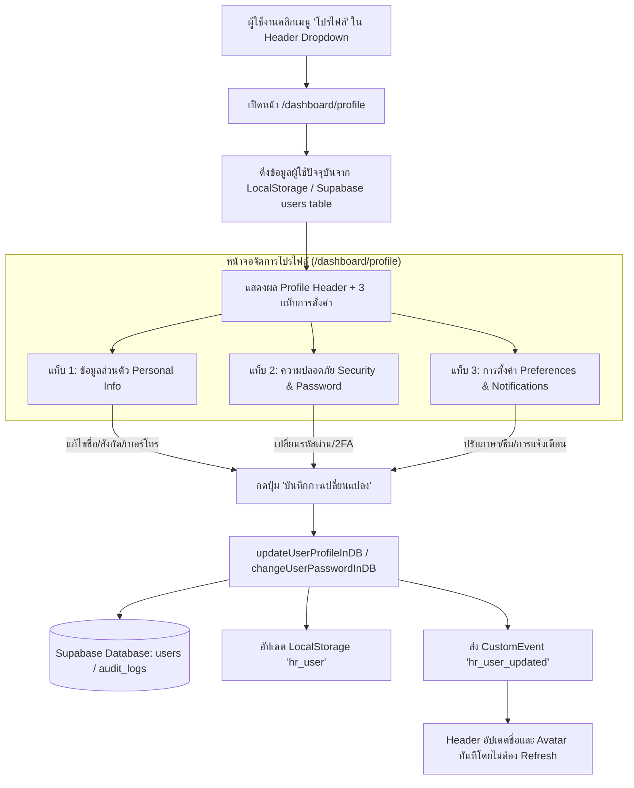

# 📑 พิมพ์เขียวและแผนการพัฒนาหน้าจัดการข้อมูลโปรไฟล์ผู้ใช้งาน (Manage Profile Page Blueprint)

---

## 📌 1. ภาพรวมและเป้าหมายของระบบ (Executive Summary)

เอกสารฉบับนี้กำหนดรายละเอียดและพิมพ์เขียวการพัฒนาหน้า **Manage Profile (`/dashboard/profile`)** สำหรับเจ้าหน้าที่และผู้ดูแลระบบ HR AI Agent เพื่อให้สามารถดูและแก้ไขข้อมูลส่วนตัว, ปรับเปลี่ยนรูปภาพโปรไฟล์ (Avatar), จัดการความปลอดภัยและการเปลี่ยนรหัสผ่าน, ปรับแต่งการตั้งค่าการแจ้งเตือนและระบบ AI ตลอดจนเชื่อมโยงเข้ากับเมนู Header Dropdown ให้มีการซิงก์ข้อมูลแบบเรียลไทม์

---

## 🏗️ 2. สถาปัตยกรรมระบบและการไหลของข้อมูล (System Architecture Flow)



---

## 🎨 3. โครงสร้างและองค์ประกอบหน้าจอ (UI Component Blueprint)

หน้าจอจะได้รับการออกแบบด้วยแนวทาง **Modern Enterprise & Glassmorphism** เข้ากับธีมระบบ (รองรับทั้งโทนชมพู-ขาว Pink-Light และชมพู-ดำ Pink-Dark):

### 3.1 ส่วนบน: Profile Overview Card & Avatar
- **Avatar Selector**: แสดงรูปอวาตาร์ปัจจุบัน พร้อมปุ่มเปลี่ยนรูป (เลือก Preset Avatar สวยงาม หรืออัปโหลดไฟล์ภาพ)
- **User Identity**:
  - ชื่อ-นามสกุล (ภาษาไทย และ อังกฤษ): เช่น *สมชาย ประเสริฐ (Somchai Prasert)*
  - สังกัด/แผนก: *ฝ่ายทรัพยากรบุคคล (Human Resources Division)*
  - Role Badge: `<Badge className="bg-emerald-50 text-emerald-700 border-emerald-300">HR Administrator</Badge>`
  - Account Status: จุดไฟสีเขียว `Active` พร้อมวันเวลาที่เข้าสู่ระบบล่าสุด
- **Activity Stats Counter**:
  - จำนวนตำแหน่งงานที่เปิดรับ (Vacancies Managed)
  - จำนวนผู้สมัครที่คัดกรอง (Candidates Screened)
  - จำนวนการสัมภาษณ์ที่นัดหมาย (Interviews Conducted)

---

### 3.2 ส่วนแท็บการจัดการ (Tab Navigation)

#### แท็บที่ 1: ข้อมูลส่วนตัว (Personal Information)
| ฟิลด์ข้อมูล | ประเภท Input | คำอธิบาย |
| :--- | :--- | :--- |
| **ชื่อจริง - นามสกุล (TH)** | Text Input | เช่น *สมชาย ประเสริฐ* |
| **First Name - Last Name (EN)** | Text Input | เช่น *Somchai Prasert* |
| **อีเมลระบบ (Email)** | Email Input (Disabled/Read-only) | อีเมลล็อกอินหลัก พร้อมสัญลักษณ์ติ๊กถูกสีเขียว (Verified) |
| **เบอร์โทรศัพท์ติดต่อ (Phone)** | Tel Input | เช่น *081-234-5678* |
| **ฝ่าย/ต้นสังกัด (Department)** | Select / Text Input | เช่น *ฝ่ายทรัพยากรบุคคล, สำนักเทคโนโลยีสารสนเทศ* |
| **ตำแหน่งงาน (Job Title)** | Text Input | เช่น *HR Recruitment Specialist & System Admin* |
| **รหัสพนักงาน (Staff Code)** | Text Input (Read-only) | เช่น *EMP-2024-001* |

> **ปุ่มดำเนินการ:**
> - `[บันทึกข้อมูลส่วนตัว]` (Save Changes) พร้อมไอคอน FloppyDisk และสถานะ Loading Spin

---

#### แท็บที่ 2: ความปลอดภัยและรหัสผ่าน (Security & Password)
- **แบบฟอร์มเปลี่ยนรหัสผ่าน (Change Password)**:
  - รหัสผ่านปัจจุบัน (Current Password) พร้อมปุ่มเปิด/ปิดรูปลูกตาดูรหัส
  - รหัสผ่านใหม่ (New Password) มีแถบประเมินความปลอดภัย (Strength Meter: Weak / Medium / Strong)
  - ยืนยันรหัสผ่านใหม่ (Confirm New Password)
- **ระบบยืนยันตัวตน 2 ขั้นตอน (Two-Factor Authentication - 2FA)**:
  - สวิตช์เปิด/ปิด 2FA ผ่านแอป Authenticator หรือ Email OTP
- **ประวัติการเข้าสู่ระบบล่าสุด (Active Login Sessions)**:
  - ตารางแสดงรายการ Login ล่าสุด (วันเวลา, อุปกรณ์/Browser, IP Address, สถานะ) ดึงจากตาราง `audit_logs`

---

#### แท็บที่ 3: การตั้งค่าระบบและการแจ้งเตือน (Preferences & Notifications)
- **การตั้งค่าภาษา (Language Preference)**:
  - เลือกภาษาหลักของระบบ: ภาษาไทย (TH) / English (EN)
- **การตั้งค่าธีมสี (Theme Preference)**:
  - ธีมสีชมพู-ขาว (Pink-Light) / ชมพู-ดำ (Pink-Dark)
- **ช่องทางการแจ้งเตือน (Notification Preferences)**:
  - [x] แจ้งเตือนเมื่อมีผู้สมัครยื่นใบสมัครใหม่ (New Application Alerts)
  - [x] แจ้งเตือนเมื่อ AI Gemini คัดกรองและประเมิน Match Score เสร็จสิ้น
  - [x] แจ้งเตือนล่วงหน้า 1 ชั่วโมงก่อนถึงเวลานัดสัมภาษณ์ (Interview Reminders)
  - [x] แจ้งเตือนผ่านอีเมล (Email Notifications)
- **AI Agent Copilot Assistance**:
  - สวิตช์เปิด/ปิด: ให้ AI ช่วยแนะนำคำถามสัมภาษณ์และสรุปโปรไฟล์อัตโนมัติ

---

## 🗄️ 4. การจัดการฐานข้อมูล Supabase (Database Schema & DDL)

### ตาราง `users` ใน Supabase
คอลัมน์เดิมในระบบรองรับการจัดเก็บข้อมูลโปรไฟล์อยู่แล้ว:
```sql
-- โครงสร้างตาราง users ปัจจุบัน
CREATE TABLE IF NOT EXISTS users (
  id BIGINT GENERATED BY DEFAULT AS IDENTITY PRIMARY KEY,
  email VARCHAR(255) NOT NULL UNIQUE,
  name VARCHAR(255) NOT NULL,
  name_th VARCHAR(255),
  role_id BIGINT REFERENCES roles(id),
  department VARCHAR(100),
  avatar_url TEXT,
  phone VARCHAR(20),
  position VARCHAR(100),
  is_active BOOLEAN DEFAULT TRUE,
  created_at TIMESTAMPTZ DEFAULT NOW(),
  updated_at TIMESTAMPTZ DEFAULT NOW()
);
```

---

## 💻 5. โค้ด Service Layer ที่ต้องเพิ่ม (`src/pageback/services/supabase-service.ts`)

```typescript
/**
 * อัปเดตข้อมูลโปรไฟล์ผู้ใช้งานลงใน Supabase และซิงก์เข้า LocalStorage
 */
export async function updateUserProfileInDB(
  userId: string,
  data: {
    name?: string;
    nameTh?: string;
    phone?: string;
    department?: string;
    avatarUrl?: string;
    position?: string;
  }
): Promise<{ success: boolean; error?: string }> {
  try {
    const numId = Number(userId);
    const { error } = await supabase
      .from('users')
      .update({
        name: data.name,
        name_th: data.nameTh,
        phone: data.phone,
        department: data.department,
        avatar_url: data.avatarUrl,
        position: data.position,
        updated_at: new Date().toISOString(),
      })
      .eq('id', isNaN(numId) ? userId : numId);

    if (error) throw error;

    // อัปเดต LocalStorage เพื่อให้ทั้งเว็บแสดงผลทันที
    if (typeof window !== 'undefined') {
      const current = JSON.parse(localStorage.getItem('hr_user') || '{}');
      const updated = {
        ...current,
        name: data.name || current.name,
        nameTh: data.nameTh || current.nameTh,
        phone: data.phone || current.phone,
        department: data.department || current.department,
        avatarUrl: data.avatarUrl || current.avatarUrl,
        position: data.position || current.position,
      };
      localStorage.setItem('hr_user', JSON.stringify(updated));
      
      // ส่ง Broadcast Event ให้ Header และส่วนอื่นๆ re-render
      window.dispatchEvent(new Event('hr_user_updated'));
    }

    return { success: true };
  } catch (err: any) {
    return { success: false, error: err.message || 'บันทึกข้อมูลไม่สำเร็จ' };
  }
}
```

---

## 🔗 6. การเชื่อมต่อ Header Dropdown (`src/pagefront/layout/Header.tsx`)

แปลงเมนูคลิกใน `Header.tsx`:

```tsx
<DropdownMenuItem asChild>
  <Link
    href="/dashboard/profile"
    className="text-xs font-medium text-slate-700 dark:text-slate-300 hover:bg-pink-50 dark:hover:bg-slate-800 rounded-lg cursor-pointer py-2 flex items-center gap-2 w-full"
  >
    <HugeiconsIcon icon={User03Icon} size={14} className="text-slate-500" />
    <span>{locale === 'th' ? 'โปรไฟล์' : 'Profile'}</span>
  </Link>
</DropdownMenuItem>
```

---

## 📋 7. แผนการดำเนินงานเป็นขั้นตอน (Implementation Checklist)

- [ ] **Step 1: เพิ่มฟังก์ชันใน Service Layer**
  - เพิ่ม `updateUserProfileInDB` และ `changeUserPasswordInDB` ใน `src/pageback/services/supabase-service.ts`
  - Export ใน `src/pageback/services/index.ts`
- [ ] **Step 2: สร้างหน้า Manage Profile**
  - สร้างไฟล์ `src/app/dashboard/profile/page.tsx`
  - ใส่ Tab navigation 3 แท็บ (ข้อมูลส่วนตัว, ความปลอดภัย, การตั้งค่า)
  - ตกแต่งด้วย Tailwind CSS, Glassmorphism card, และ Hugeicons SVG ทั้งหมด
- [ ] **Step 3: เชื่อมต่อ Header Menu & Real-time Event**
  - ใส่ Link ใน Header Dropdown ไปยัง `/dashboard/profile`
  - เพิ่ม Event Listener `hr_user_updated` เพื่อให้ชื่อใน Header เปลี่ยนสด
- [ ] **Step 4: ตรวจสอบความถูกต้อง (Verification)**
  - รัน `npx tsc --noEmit` ให้ผ่าน 0 error
  - ทดสอบแก้ไขชื่อและบันทึกข้อมูลจริง

---
*เอกสารนี้ถูกบันทึกไว้ที่: `document/MANAGE_PROFILE_IMPLEMENTATION_PLAN.md`*
