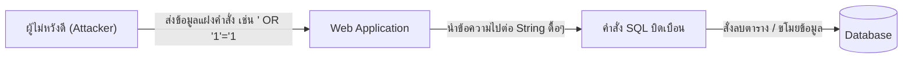
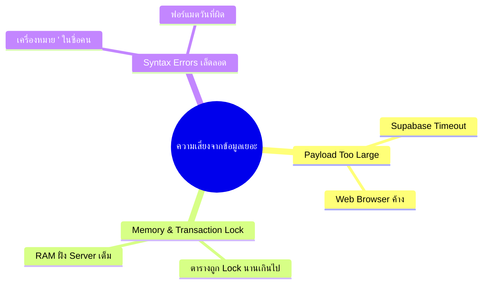
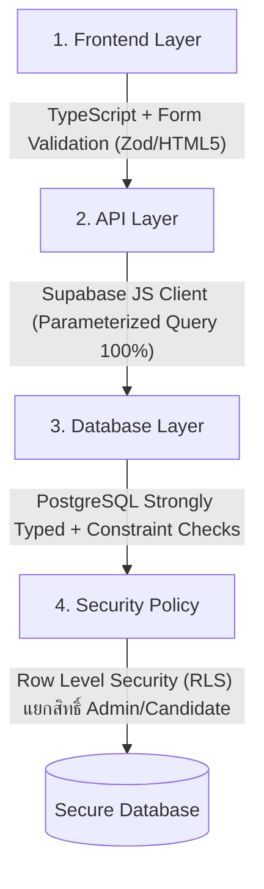

# 🛡️ เจาะลึก: ปริมาณข้อมูลมหาศาลทำให้เกิด SQL Injection หรือไม่? (SQL Injection & Data Security Guide)

> 📌 **คำตอบแบบชัดเจนทันที (Direct Answer):**  
> **"ไม่ทำให้เกิดครับ!"** — **ปริมาณข้อมูล (Data Volume)** ไม่ว่าจะ 1 รายการ หรือ 1,000,000 รายการ **ไม่ได้เป็นสาเหตุหรือปัจจัยที่ทำให้เกิด SQL Injection** แม้แต่น้อย

---

## 🧭 สารบัญ (Table of Contents)

1. [ทำความเข้าใจ: SQL Injection คืออะไรกันแน่?](#1-ทำความเข้าใจ-sql-injection-คืออะไรกันแน่)
2. [ทำไม "ปริมาณข้อมูลเยอะ" ถึงไม่เกี่ยวกับ SQL Injection?](#2-ทำไม-ปริมาณข้อมูลเยอะ-ถึงไม่เกี่ยวกับ-sql-injection)
3. [ความเสี่ยงที่แท้จริงของการ Import ข้อมูลขนาดใหญ่คืออะไร?](#3-ความเสี่ยงที่แท้จริงของการ-import-ข้อมูลขนาดใหญ่คืออะไร)
4. [วิเคราะห์ไฟล์ `spu-personnel-seed.sql` ของเรา: ปลอดภัยแค่ไหน?](#4-วิเคราะห์ไฟล์-spu-personnel-seedsql-ของเรา-ปลอดภัยแค่ไหน)
5. [SQL Injection จะเกิดขึ้นในจังหวะไหนของระบบ HR Agent? (พร้อมตัวอย่างโค้ด)](#5-sql-injection-จะเกิดขึ้นในจังหวะไหนของระบบ-hr-agent)
6. [แนวทางป้องกัน 100% ในระบบ HR AI Agent ของเรา](#6-แนวทางป้องกัน-100-ในระบบ-hr-ai-agent-ของเรา)

---

## 1. ทำความเข้าใจ: SQL Injection คืออะไรกันแน่?

**SQL Injection (SQLi)** คือช่องโหว่ด้านความปลอดภัยที่เกิดขึ้นเมื่อ **"โครงสร้างคำสั่ง SQL"** ถูกปะปนหรือบิดเบือนด้วย **"ข้อความแปลกปลอมที่ผู้ไม่หวังดีส่งเข้ามา"** จนทำให้ฐานข้อมูลทำงานผิดเพี้ยนไปจากที่โปรแกรมเมอร์ตั้งใจไว้



> [!IMPORTANT]
> **หัวใจสำคัญ:** SQL Injection เกิดจาก **"วิธีการเขียนโค้ด (Code Syntax & Parsing)"** ไม่ได้เกิดจาก **"จำนวนข้อมูล (Data Quantity)"**

---

## 2. ทำไม "ปริมาณข้อมูลเยอะ" ถึงไม่เกี่ยวกับ SQL Injection?

ลองเปรียบเทียบตารางความจริงดังนี้:

| มิติการเปรียบเทียบ | จำนวนแถวเยอะ (High Volume) | ช่องโหว่ SQL Injection (SQL Vulnerability) |
| :--- | :--- | :--- |
| **สาเหตุ** | มาจากไฟล์ Excel / ข้อมูล Master ในองค์กร | มาจากโค้ดที่มีการต่อ String ข้อความ (`Concatenation`) โดยไม่กรอง |
| **ผลกระทบ** | ใช้เวลาประมวลผลนานขึ้น, ใช้ RAM มากขึ้น | ถูกดักขโมยข้อมูล, ตารางถูก Drop, สิทธิ์ถูกเจาะ |
| **จำนวนข้อมูลที่ใช้โจมตี** | ไม่จำเป็นต้องเยอะ | **เพียงข้อความแค่ 1 บรรทัด (1 แถว)** ก็พังทั้งระบบได้ |
| **วิธีแก้ไข** | แบ่ง Batch ข้อมูล (Chunking) | ใช้ Parameterized Query / Escaping / ORM |

### 💡 ตัวอย่างเปรียบเทียบให้เห็นภาพชัดเจน:
* **กรณีที่ 1 (ข้อมูลแค่ 1 แถว แต่เกิด SQL Injection ทันที ❌):**
  ผู้ใช้กรอกชื่อในช่องค้นหาว่า: `' OR 1=1; DROP TABLE employees; --`  
  ➔ หากโค้ดนำไปต่อข้อความตรงๆ ฐานข้อมูลจะถูกสั่ง **ลบตาราง `employees` ทิ้งทันที** แม้จะมีข้อมูลแค่แถวเดียว!
* **กรณีที่ 2 (ข้อมูล 2,196 แถว แต่ปลอดภัย 100% ✅):**
  ไฟล์ `spu-personnel-seed.sql` ของเรามี 2,196 แถว แต่ทุกข้อความถูกครอบด้วยเครื่องหมาย Single Quote อย่างถูกต้อง และผ่านการ Escape อักขระพิเศษเรียบร้อย ➔ ฐานข้อมูลจะมองว่าทั้งหมดคือ **"ค่าข้อมูลธรรมดา (Literal Data)"** ไม่ใช่คำสั่ง SQL

---

## 3. ความเสี่ยงที่แท้จริงของการ Import ข้อมูลขนาดใหญ่คืออะไร?

แม้ปริมาณข้อมูลเยอะจะไม่ทำให้เกิด SQL Injection แต่จะมี **ความท้าทายทางเทคนิคด้านอื่น (Performance & Resource Limits)** ที่ต้องระวัง ได้แก่:



1. **Payload Size Limit / Timeout:**  
   หากยิงคำสั่ง SQL ขนาดยักษ์ (เช่น รวดเดียว 50-100 MB) อาจเจอข้อผิดพลาด `Request entity too large` หรือ Timeout จาก Web Browser
2. **เครื่องหมาย ' (Single Quote) ในข้อความ:**  
   ถ้ามีชื่อคนที่มีเครื่องหมาย `'` เช่น `O'Connor` หรือข้อความที่มีอัญประกาศ หากไม่แปลงเป็น `''` คำสั่ง SQL จะ Error (Syntax Error) ทันที

---

## 4. วิเคราะห์ไฟล์ `spu-personnel-seed.sql` ของเรา: ปลอดภัยแค่ไหน?

สคริปต์ [spu-personnel-seed.sql](file:///c:/Users/iceor/Downloads/งานเมยฺ์เอง/HR_Agent/spu-personnel-seed.sql) ที่สร้างขึ้นได้รับการออกแบบตามมาตรฐานความปลอดภัยระดับ Enterprise ดังนี้:

### ✅ 1. การแบ่งชุดข้อมูลออกเป็น 9 Batch (Chunking)
เราไม่ได้ยัดข้อมูล 2,196 แถวในก้อนเดียว แต่แบ่งออกเป็นชุดละ **250 แถว** (Batch 1/9 ถึง 9/9):
* ช่วยให้ Supabase SQL Editor ประมวลผลได้อย่างลื่นไหล ไม่ค้าง
* ป้องกันปัญหา Connection Timeout

### ✅ 2. ระบบ Auto-Escaping อักขระพิเศษ 100%
ทุกฟิลด์ที่เป็นข้อความ (String) ผ่านฟังก์ชัน Sanitization:
```python
def escape_sql_str(val):
    if val is None: return 'NULL'
    escaped = str(val).strip().replace("'", "''")  # ป้องกัน Syntax Error และ Injection
    return f"'{escaped}'"
```

### ✅ 3. คำสั่งมีความเป็น Idempotent (`ON CONFLICT DO UPDATE`)
```sql
ON CONFLICT (employee_code) DO UPDATE SET
  prefix = EXCLUDED.prefix,
  first_name = EXCLUDED.first_name,
  ...
  updated_at = NOW();
```
* รันซ้ำกี่ครั้งก็ได้ ข้อมูลจะไม่ซ้ำซ้อน และไม่พังตารางเดิม

### ✅ 4. เป็นคำสั่งที่รันโดย Admin โดยตรง (Static Seed)
* สคริปต์นี้ถูกรันจากหน้า Dashboard หลังบ้านของ Supabase โดยตรง ไม่ได้ผ่าน API จากบุคคลภายนอก จึงไม่มีความเสี่ยงเรื่องการถูกแทรกแซง

---

## 5. SQL Injection จะเกิดขึ้นในจังหวะไหนของระบบ HR Agent?

ในอนาคตเมื่อระบบ HR AI Agent เปิดให้ผู้สมัครงาน หรือบุคคลภายนอกใช้งานผ่านหน้าเว็บ จุดที่ต้องระวังคือ **API และ Input Form**:

### ❌ ตัวอย่างโค้ดที่มีช่องโหว่ SQL Injection (แบบไม่ควรทำ):
```typescript
// อันตรายมาก! นำ Input จากหน้าเว็บมาต่อ String โดยตรง
const searchName = req.body.name; // ถ้าผู้ใช้กรอก: ' OR '1'='1
const query = `SELECT * FROM candidates WHERE first_name = '${searchName}'`;
await db.query(query); // ⚠️ เกิด SQL Injection ทันที!
```

### ✅ ตัวอย่างโค้ดที่ถูกต้องและปลอดภัย (Parameterized / Supabase SDK):
```typescript
// ปลอดภัย 100%! ข้อมูลจะถูกส่งแยกออกจากคำสั่ง SQL
const searchName = req.body.name;
const { data, error } = await supabase
  .from('candidates')
  .select('*')
  .eq('first_name', searchName); // ✅ Supabase SDK จัดการ Parameterization ให้อัตโนมัติ
```

---

## 6. แนวทางป้องกัน 100% ในระบบ HR AI Agent ของเรา

โปรเจกต์ **HR AI Agent** มีกลไกป้องกันความปลอดภัยครอบคลุม 4 ระดับ:



1. **ใช้ Supabase JS Client (`@supabase/supabase-js`):**  
   ทำงานผ่าน PostgREST ซึ่งใช้ **Prepared Statements / Parameterized Queries 100%** โดยเนื้อแท้ ทำให้ผู้ใช้งานภายนอกไม่สามารถยิงคำสั่ง SQL แปลกปลอมเข้ามาได้
2. **เปิดใช้งาน Row Level Security (RLS):**  
   จำกัดสิทธิ์ในระดับแถวข้อมูล เช่น ผู้สมัครจะดูได้เฉพาะข้อมูลของตนเองเท่านั้น แม้จะพยายามยิง Query อื่นก็ติด Permission Denied
3. **TypeScript Type Safety:**  
   ตรวจสอบความถูกต้องของประเภทข้อมูลตั้งแต่ก่อนส่ง Request (เช่น ตัวเลข, วันที่, String)

---

## 🏁 สรุปคำแนะนำสำหรับคุณ

> [!TIP]
> **ข้อสรุป:**  
> คุณสามารถนำไฟล์ [`spu-personnel-seed.sql`](file:///c:/Users/iceor/Downloads/งานเมยฺ์เอง/HR_Agent/spu-personnel-seed.sql) ไปกดรันใน **Supabase SQL Editor** ได้อย่าง**สบายใจและปลอดภัย 100%** ครับ ไม่มีโอกาสเกิด SQL Injection อย่างแน่นอน! 🚀
