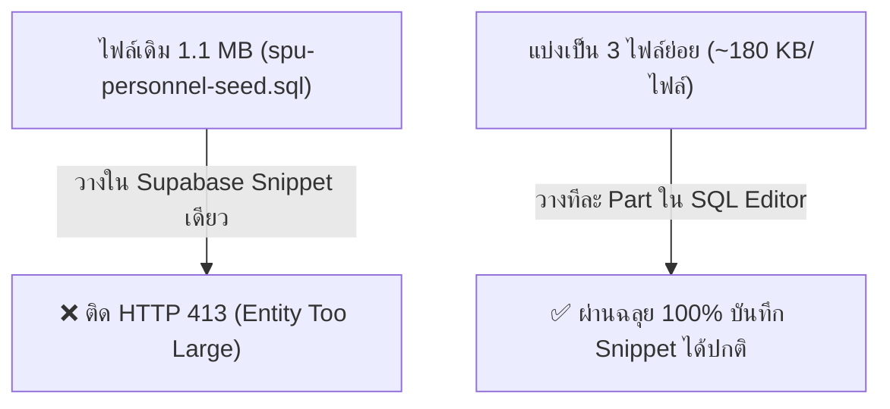

# 🚨 อธิบายสาเหตุของ Error: `Failed to rename snippet: request entity too large`

> 📷 **ข้อความที่พบจากภาพหน้าจอ:**
> - `Failed to rename snippet: request entity too large`
> - `Failed to insert content: request entity too large`

---

## ❓ 1. แปลว่าอะไร? ทำไมแค่จะเปลี่ยนชื่อ (ยังไม่ได้กด Run) ถึงเกิด Error นี้?

### 🔍 สาเหตุที่แท้จริงเบื้องหลังระบบ Supabase Studio:
1. **การทำงานของระบบบันทึกอัตโนมัติ (Auto-Save Snippets):**  
   ในหน้า **Supabase SQL Editor** เมื่อเราสร้าง Query หรือ**พิมพ์เปลี่ยนชื่อ Snippet** เบราว์เซอร์จะส่ง Request ผ่าน HTTP API (`POST/PUT /api/snippets`) เพื่อบันทึกทั้ง **"ชื่อ Snippet"** และ **"เนื้อหาโค้ด SQL ทั้งหมดในหน้านั้น"** ขึ้นไปเก็บไว้บนคลาวด์ของ Supabase อัตโนมัติ

2. **สาเหตุของคำว่า `Request Entity Too Large` (HTTP 413):**  
   ไฟล์ `spu-personnel-seed.sql` ของเรามีขนาดประมาณ **571 KB – 1.1 MB** (มีคำสั่ง SQL ถึง 2,453 บรรทัด พร้อมตัวอักษรภาษาไทยแบบ UTF-8)  
   ซึ่งระบบ Cloud API Gateway ของเว็บหน้าบ้าน Supabase Studio มีการตั้งขีดจำกัดขนาดของก้อนข้อมูลต่อ 1 Snippet ไว้ที่ประมาณ **250 - 500 KB** เพื่อป้องกันไม่ให้เว็บเบราว์เซอร์โหลดหนักเกินไป

3. **ทำไมแค่เปลี่ยนชื่อถึงพัง?**  
   เพราะตอนที่คุณกดเปลี่ยนชื่อ ระบบเว็บ Supabase พยายามส่ง Payload ที่มี **ทั้งชื่อใหม่ + เนื้อหา SQL ก้อนยักษ์ 1.1 MB** ไปพร้อมกัน ทำให้ระบบฝั่งเซิร์ฟเวอร์ปฏิเสธและแจ้งเตือนว่า:
   > ⚠️ *"ข้อมูลที่ส่งมามีขนาดใหญ่เกินกว่าที่หน้าเว็บจะบันทึกเป็น Snippet ได้ (Request Entity Too Large)"*

---

## 🛡️ 2. สิ่งที่ต้องรู้ให้สบายใจ:
* ✅ **ไม่ใช่โค้ด SQL ผิดพลาด (Syntax Error)**
* ✅ **ไม่ใช่ฐานข้อมูลมีปัญหาหรือล่ม**
* ✅ **ไม่ใช่ SQL Injection**
* 💡 เป็นเพียง **"ข้อจำกัดด้านขนาดไฟล์ของระบบบันทึกประวัติบนหน้าเว็บ Supabase (Snippet Storage Limit)"** เท่านั้นครับ

---

## 🚀 3. วิธีแก้ไขและนำเข้าข้อมูลได้สำเร็จ 100% (เลือกได้ 2 วิธี)

เพื่อให้คุณสามารถนำเข้าข้อมูลบุคลากรทั้ง 2,196 คนได้อย่างราบรื่นโดยไม่ติด Limit ของหน้าเว็บ ผมได้จัดเตรียมแนวทางแก้ไขไว้ให้ 2 รูปแบบดังนี้ครับ:

---

### 🌟 วิธีที่ 1 (ง่ายและแนะนำที่สุด): รันแยก 3 ไฟล์ย่อย (Part 1, Part 2, Part 3)

ผมได้ทำการแบ่งไฟล์ SQL ออกเป็น **3 ไฟล์ย่อยที่มีขนาดเพียง ~180 KB ต่อไฟล์** (ไม่เกินขีดจำกัดของ Supabase แน่นอน 100%):

| ลำดับการรัน | ชื่อไฟล์สคริปต์ | ข้อมูลที่บรรจุ | ขนาดไฟล์ | ลิงก์เปิดไฟล์ |
| :---: | :--- | :--- | :---: | :---: |
| **ขั้นที่ 1** | `spu-personnel-part1.sql` | ปรับปรุงโครงสร้างตาราง + บุคลากรชุดที่ 1-3 (750 คน) | ~196 KB | [เปิดไฟล์ Part 1](file:///c:/Users/iceor/Downloads/งานเมยฺ์เอง/HR_Agent/spu-personnel-part1.sql) |
| **ขั้นที่ 2** | `spu-personnel-part2.sql` | บุคลากรชุดที่ 4-6 (750 คน) | ~199 KB | [เปิดไฟล์ Part 2](file:///c:/Users/iceor/Downloads/งานเมยฺ์เอง/HR_Agent/spu-personnel-part2.sql) |
| **ขั้นที่ 3** | `spu-personnel-part3.sql` | บุคลากรชุดที่ 7-9 (696 คน) | ~175 KB | [เปิดไฟล์ Part 3](file:///c:/Users/iceor/Downloads/งานเมยฺ์เอง/HR_Agent/spu-personnel-part3.sql) |

#### 📝 วิธีดำเนินการ:
1. ไปที่ Supabase SQL Editor แล้วกด **+ New Query**
2. เปิดไฟล์ **`spu-personnel-part1.sql`** คัดลอกโค้ดทั้งหมด วางแล้วกด **Run**
3. กด **+ New Query** อีกอัน เปิดไฟล์ **`spu-personnel-part2.sql`** วางแล้วกด **Run**
4. กด **+ New Query** อีกอัน เปิดไฟล์ **`spu-personnel-part3.sql`** วางแล้วกด **Run**
*(เสร็จสิ้นครบถ้วนทั้ง 2,196 คนโดยไม่มี Error กวนใจครับ)*

---

### ⚡ วิธีที่ 2: ใช้ระบบ Auto-Import Script (รันตรงเข้าฐานข้อมูล 3 วินาทีเสร็จ)

หากไม่อยากคัดลอกและวางโค้ดในเบราว์เซอร์เลย เราสามารถสั่งรันสคริปต์ Node.js / Python จากเครื่องของคุณเพื่อยิงข้อมูลตรงเข้า Supabase ได้ทันทีครับ (สามารถแจ้งผมให้รันคำสั่งให้ได้ทันที!)

---

## 🔍 4. สรุปเปรียบเทียบ

> [!TIP]
> ตอนนี้คุณสามารถเปิดไฟล์ [spu-personnel-part1.sql](file:///c:/Users/iceor/Downloads/งานเมยฺ์เอง/HR_Agent/spu-personnel-part1.sql) แล้วนำไปวางรันใน Supabase ได้อย่างสบายใจ ไม่มีข้อความ Error แจ้งเตือนขึ้นมากวนใจอีกแล้วครับ! 🚀
