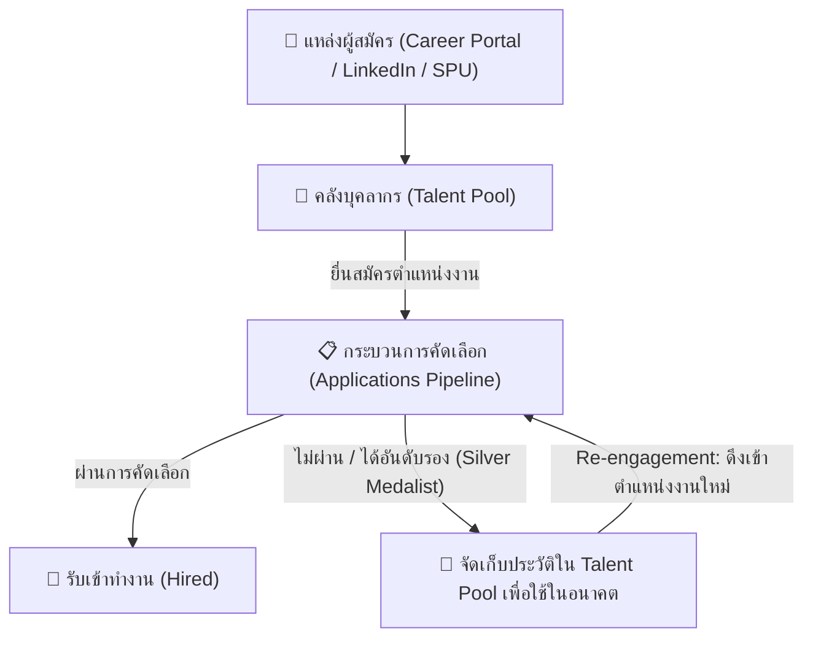

# 🌟 เอกสารแนวทางการพัฒนา: ระบบคลังบุคลากรอัจฉริยะ (Talent Pool & Sourcing Bank)

---

## 📌 1. บทนำและแนวคิดเชิงสถาปัตยกรรม (Architecture Concept)

ในระบบบริหารจัดการการสรรหาบุคลากรสมัยใหม่ (Modern HR Recruitment & ATS) การแยกบทบาทระหว่าง **"ใบสมัคร (Applications)"** และ **"คลังบุคลากร (Talent Pool)"** มีความสำคัญอย่างยิ่งต่อการลดต้นทุนและร่นระยะเวลาในการสรรหาคน (Time-to-Hire):



* **📋 หน้า "ใบสมัคร" (Applications):** เน้นการทำงานแบบ **Active Transaction / Hiring Pipeline** สำหรับตำแหน่งงานที่กำลังเปิดรับอยู่ ติดตามขั้นตอนคัดกรอง, AI Match Score, การสัมภาษณ์ และการส่ง Offer
* **🌟 หน้า "คลังบุคลากร" (Talent Pool):** เน้นการทำงานแบบ **Long-term Talent Sourcing & Rediscovery** เป็นฐานข้อมูลรวบรวมประวัติและทักษะของทุกคนที่เคยสมัคร เพื่อให้ HR สามารถค้นหาและดึงตัวกลับมาพิจารณาในตำแหน่งใหม่ได้ทันทีโดยไม่ต้องลงประกาศรับสมัครใหม่จากศูนย์

---

## 🚀 2. ฟังก์ชันที่ได้รับการพัฒนาแล้วในปัจจุบัน (Current Implementation)

หน้า **คลังบุคลากร (`/dashboard/candidates`)** ได้รับการยกระดับฟีเจอร์สำคัญ ดังนี้:

### 2.1 📊 แดชบอร์ดสรุปสถิติคลังบุคลากร (Talent KPI Overview)
* **บุคลากรในคลังทั้งหมด (Total Talents):** แสดงจำนวนประวัติบุคลากรที่ซิงค์สดจากตาราง `candidates`
* **ศักยภาพสูง (High Match Rate $\ge 80\%$):** กรองผู้สมัครที่มีคะแนนประเมินจาก AI ในระดับดีเยี่ยม
* **มีประสบการณ์ ($\ge 2$ ปี):** คัดกรองผู้มีประสบการณ์พร้อมปฏิบัติงานทันที
* **ตำแหน่งงานว่างที่พร้อมรองรับ (Active Vacancies):** แสดงจำนวนตำแหน่งงานว่างที่สามารถดึงคนไปร่วมงานได้

### 2.2 🔍 แถบเครื่องมือค้นหาและกรองทักษะ (Skill & Experience Sourcing Toolbar)
* **ค้นหาแบบ Multi-Criteria:** ค้นหาตามชื่อ-นามสกุล, อีเมล, เบอร์โทร, ตำแหน่งงานเดิม, บริษัท หรือทักษะ
* **ปุ่มกรองทักษะ (Skill Chips):** กรองตามทักษะเฉพาะทาง เช่น `React`, `TypeScript`, `Python`, `Machine Learning`, `PostgreSQL`, `Data Analysis`
* **กรองตามระดับประสบการณ์:** แบ่งตามช่วงปี (`0-2 ปี`, `3-5 ปี`, `5+ ปี`)

### 2.3 📇 การ์ดโปรไฟล์บุคลากร (Talent Profile Cards)
* **ป้ายสถานะประเมินตนเอง:** ป้าย `⭐ High Potential`, `💎 มีประสบการณ์ตรง`
* **ประวัติการสมัครในระบบ (Past Application History):** แสดงตำแหน่งเดิมที่เคยสมัคร พร้อมสถานะจริงจากตาราง `applications`
* **ทักษะที่ตรงกัน:** ไฮไลต์แท็กทักษะตามคำค้นหาอย่างชัดเจน

### 2.4 🎯 ระบบ Re-engagement (ดึงผู้สมัครเข้าสู่ตำแหน่งงานว่างใหม่ใน 1 คลิก)
* เมื่อ HR พบผู้สมัครในคลังที่น่าสนใจ สามารถกดปุ่ม **`🎯 ดึงเข้าตำแหน่ง`**
* ระบบจะเปิด Modal ให้เลือกตำแหน่งงานว่างที่เปิดรับอยู่ (`Active Vacancies`)
* เมื่อกดยืนยัน ระบบจะสร้าง Record ในตาราง `applications` และเชื่อมต่อผู้สมัครเข้าสู่กระบวนการคัดเลือกของตำแหน่งใหม่ทันที

---

## 🔮 3. แผนที่แนวทางการพัฒนาในอนาคต (Future Development Roadmap)

เพื่อยกระดับให้ระบบ **Talent Pool** ของ HR AI Agent ทำงานได้อย่างเต็มประสิทธิภาพสูงสุด ขอเสนอแนวทางการพัฒนาเป็น 4 ระยะ (Phases) ดังนี้:

```
[Phase 1] AI Headhunting & Matching  ➔  [Phase 2] Smart Tagging & Silver Medalists
                                                  │
[Phase 4] Alumni & Internal Mobility   [Phase 3] Auto Re-engagement Campaigns
```

---

### 🔹 Phase 1: ระบบ AI Headhunting แนะนำผู้สมัครจากคลังอัตโนมัติ
* **เป้าหมาย:** เมื่อ HR สร้างตำแหน่งงานใหม่ (Vacancy) ระบบ AI Gemini จะไปสแกนค้นหาใน **Talent Pool** อัตโนมัติ แล้วนำเสนอรายชื่อ 3-5 คนที่มีทักษะตรงที่สุดขึ้นมาให้ HR พิจารณาทันทีโดยไม่ต้องรอให้มีคนมาสมัครใหม่
* **สิ่งที่ต้องพัฒนา:**
  * Endpoint API: `/api/ai/match-talent-pool?vacancyId=...`
  * UI: กล่อง *"🤖 AI แนะนำผู้สมัครที่เหมาะสมจากคลังบุคลากร"* ในหน้ารายละเอียด Vacancy

---

### 🔹 Phase 2: ระบบ Smart Tagging & Silver Medalist Tracking
* **เป้าหมาย:** จัดหมวดหมู่ผู้สมัครอย่างเป็นระบบ โดยเฉพาะกลุ่ม **"Silver Medalist"** (ผู้สมัครที่เก่งมาก ได้คะแนนสัมภาษณ์สูง แต่รับได้เพียง 1 คนในตำแหน่งเดิม)
* **สิ่งที่ต้องพัฒนา:**
  * เพิ่มฟิลด์ `tags: text[]` ในตาราง `candidates` เช่น `['SILVER_MEDALIST', 'TOP_INTERVIEW', 'FUTURE_LEAD']`
  * ตัวกรองเฉพาะสำหรับค้นหา Silver Medalist ในหน้า Talent Pool

---

### 🔹 Phase 3: ระบบส่งอีเมลเทียบเชิญอัตโนมัติ (Automated Re-engagement Campaigns)
* **เป้าหมาย:** เมื่อดึงผู้สมัครเข้าสู่ตำแหน่งใหม่ ระบบจะร่างอีเมลด้วย AI และส่งไปยังอีเมลของผู้สมัครอัตโนมัติ เช่น:
  > *"เรียนคุณ Phanloed ทางมหาวิทยาลัยศรีปทุมมีตำแหน่งใหม่ 'Senior Frontend Engineer' ที่ตรงกับความเชี่ยวชาญของคุณ ทางเราขอเรียนเชิญท่านเข้าร่วมการสัมภาษณ์รอบพิเศษ..."*
* **สิ่งที่ต้องพัฒนา:**
  * การเชื่อมต่อบริการอีเมล (เช่น Resend หรือ SendGrid)
  * ฟังก์ชัน AI Email Generator ในการร่างข้อความเทียบเชิญ

---

### 🔹 Phase 4: เชื่อมต่อฐานข้อมูลศิษย์เก่า & บุคลากรภายใน (Internal Mobility & Alumni)
* **เป้าหมาย:** เชื่อมโยง Talent Pool กับฐานข้อมูลศิษย์เก่า SPU และบุคลากรภายในที่ต้องการเติบโตในสายงานใหม่ (Career Transition)
* **สิ่งที่ต้องพัฒนา:**
  * เพิ่มประเภท `source: 'INTERNAL_EMPLOYEE' | 'ALUMNI' | 'EXTERNAL'`
  * ตัวกรองพิเศษสำหรับค้นหาศิษย์เก่าและบุคลากรภายใน

---

## 📂 4. สรุปความสัมพันธ์ของไฟล์ในระบบ (Source Code Map)

| ไฟล์ | หน้าที่และความรับผิดชอบ |
| :--- | :--- |
| `src/app/dashboard/candidates/page.tsx` | หน้าหลัก **คลังบุคลากร (Talent Pool & Sourcing Bank)** |
| `src/app/dashboard/candidates/[id]/page.tsx` | หน้ารายละเอียดประวัติส่วนตัว, การศึกษา, ภาษา และเอกสารแนบ |
| `src/app/dashboard/applications/page.tsx` | หน้ากระบวนการคัดเลือกใบสมัครหลัก (**Applications Pipeline**) |
| `src/pagefront/layout/Sidebar.tsx` | แถบเมนูด้านซ้าย แสดงปุ่ม `🌟 คลังบุคลากร (Talent Pool)` |
| `src/pageback/services/supabase-service.ts` | ฟังก์ชันดึงข้อมูลผู้สมัคร, เอกสารแนบ, และฟังก์ชัน `submitApplicationToDB` |
| `src/lib/i18n.ts` | คำแปลและข้อความภาษาไทย/อังกฤษสำหรับระบบ Talent Pool |

---

> 📝 **จัดทำโดย:** ระบบ AI Pair Programming Assistant  
> 📅 **วันที่:** สิงหาคม 2569  
