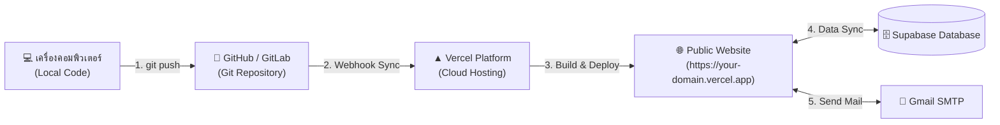

# 🚀 คู่มือขั้นตอนการ Deploy โปรเจกต์ HR AI Agent ขึ้น Git และ Vercel สู่ Public

---

## 📌 คำตอบสรุป (Direct Answer)

> **"สามารถทำได้ 100% ครับ และเป็นวิธีที่ดีและแนะนำมากที่สุดสำหรับ Next.js!"**

เนื่องจากโปรเจกต์นี้พัฒนาด้วย **Next.js (App Router)** ซึ่งเป็น Framework ที่พัฒนาโดยบริษัท **Vercel** โดยตรง ดังนั้นการนำโค้ดขึ้น **GitHub/GitLab** แล้วเชื่อมต่อกับ **Vercel** จะทำให้:
1. ได้ **Public URL (HTTPS)** ใช้งานได้ฟรีทันที (เช่น `https://hr-ai-agent.vercel.app`)
2. มีระบบ **CI/CD อัตโนมัติ**: เมื่อคุณแก้ไขโค้ดและ `git push` ขึ้นไปใหม่ Vercel จะ Build และอัปเดตระบบให้เองทันที
3. เชื่อมต่อกับฐานข้อมูล **Supabase** และระบบส่งอีเมลได้สมบูรณ์แบบ

---

## ⚠️ จุดสำคัญที่ต้องระวังเป็นพิเศษสำหรับโปรเจกต์นี้

โครงสร้างโฟลเดอร์ของโปรเจกต์คุณเป็นแบบนี้:
```text
HR_Agent/                    <-- Root โฟลเดอร์ของ Git
├── .git/
├── hr-ai-agent/             <-- ⚠️ ตัวโปรเจกต์ Next.js จริงๆ อยู่ในโฟลเดอร์นี้!
│   ├── package.json
│   ├── src/
│   └── ...
└── document/
```

> [!IMPORTANT]
> ในขั้นตอนการตั้งค่าบน Vercel คุณจะต้องกำหนดค่า **Root Directory** ให้ชี้ไปที่โฟลเดอร์ **`hr-ai-agent`** เสมอ (ไม่ใช่หน้าแรกสุด) เพื่อให้ Vercel หาไฟล์ `package.json` เจอและ Build ได้ถูกต้อง

---

## 🗺️ แผนผังภาพรวมการ Deploy (Deployment Flow)



---

## 📋 ขั้นตอนการ Deploy ทั้งหมดทีละสเต็ป (Step-by-Step Guide)

---

### ขั้นตอนที่ 1: เตรียม Git และ Push โค้ดขึ้น GitHub

1. เปิด Terminal ในเครื่อง แล้วตรวจสอบไฟล์ที่จะ Commit:
   ```bash
   git status
   ```
2. เพิ่มไฟล์ทั้งหมดและ Commit:
   ```bash
   git add .
   git commit -m "feat: complete HR AI Agent system ready for deployment"
   ```
3. Push โค้ดขึ้นไปยัง GitHub Repository ของคุณ:
   ```bash
   git push origin main
   ```
   *(หากยังไม่ได้เชื่อม GitHub Remote ให้สร้าง Repository ใหม่บน [GitHub.com](https://github.com) แล้วนำ URL มาสั่ง `git remote add origin <URL>`)*

---

### ขั้นตอนที่ 2: เชื่อมต่อ Vercel กับ GitHub

1. ไปที่เว็บไซต์ **[https://vercel.com](https://vercel.com)**
2. สมัครสมาชิกหรือเข้าสู่ระบบด้วยบัญชี **GitHub** (แนะนำวิธีนี้เพราะจะเชื่อมสิทธิ์ให้อัตโนมัติ)

---

### ขั้นตอนที่ 3: นำเข้าโปรเจกต์ (Import Project)

1. ในหน้า Vercel Dashboard กดปุ่ม **"Add New..."** ➔ เลือก **"Project"**
2. เลือก Repository ของคุณที่เพิ่ง Push ขึ้นไป (เช่น `HR_Agent`) แล้วกดปุ่ม **"Import"**

---

### ขั้นตอนที่ 4: ตั้งค่าสำคัญบน Vercel (จุดที่ห้ามพลาด!)

ก่อนกดปุ่ม Deploy ให้ตรวจสอบการตั้งค่า 2 จุดนี้:

#### 1) ตั้งค่า Root Directory (สำคัญที่สุด!)
- ในส่วน **Root Directory** ให้กดปุ่ม **Edit**
- เลือกหรือพิมพ์: `hr-ai-agent`
- กดปุ่ม **Continue**

#### 2) ตั้งค่า Environment Variables (ตัวแปรสภาพแวดล้อม)
ให้คัดลอกค่าจากไฟล์ `.env.local` ในเครื่องของคุณไปใส่ในช่อง **Environment Variables** บน Vercel:

| KEY (ชื่อตัวแปร) | ความหมาย |
| :--- | :--- |
| `NEXT_PUBLIC_SUPABASE_URL` | URL ของ Supabase Project |
| `NEXT_PUBLIC_SUPABASE_ANON_KEY` | Anon Public Key ของ Supabase |
| `SMTP_HOST` | `smtp.gmail.com` |
| `SMTP_PORT` | `465` |
| `SMTP_USER` | อีเมลที่ใช้ส่งแจ้งเตือน |
| `SMTP_PASS` | รหัสผ่าน App Password ของ Gmail |
| `SMTP_FROM` | ชื่อผู้ส่ง เช่น `HR System <email@...>` |
| `GEMINI_API_KEY` | (ถ้ามี) API Key สำหรับ AI Gemini |

---

### ขั้นตอนที่ 5: กด Deploy และเริ่มใช้งาน

1. เมื่อกรอกข้อมูลครบถ้วนแล้ว ให้กดปุ่ม **"Deploy"**
2. รอระบบ Vercel ทำการดาวน์โหลด Dependencies และ Build โค้ด (ใช้เวลาประมาณ 1-2 นาที)
3. เมื่อเสร็จสิ้น Vercel จะแสดงหน้ายินดีด้วย **"Congratulations!"** พร้อมลิงก์ Public Domain:
   - ตัวอย่างเช่น: `https://hr-ai-agent-xxx.vercel.app`
4. คุณสามารถเปิดลิงก์นั้นผ่านมือถือ แท็บเล็ต หรือส่งให้ผู้อื่นเข้าใช้งานระบบได้ทันทีทั่วโลก

---

### ขั้นตอนที่ 6: การอัปเดตโค้ดในอนาคต (Continuous Deployment)

หลังจากนี้ เมื่อใดก็ตามที่คุณแก้ไขโค้ดในเครื่องคอมพิวเตอร์ของคุณ:
1. เพียงแค่รันคำสั่ง:
   ```bash
   git add .
   git commit -m "update: ปรับปรุงฟีเจอร์ใหม่"
   git push origin main
   ```
2. Vercel จะตรวจจับการ Push อัตโนมัติ แล้วทำการ Build และอัปเดตเว็บไซต์ขึ้นเวอร์ชันใหม่ให้ทันที โดยที่คุณ**ไม่ต้องเข้าไปกดอะไรใน Vercel อีกเลย**

---

## ❓ คำถามที่พบบ่อย (FAQ)

- **Q: เสียค่าบริการหรือไม่?**
  - **A: ฟรี 100%** สำหรับ Vercel Hobby Plan (มี HTTPS SSL ฟรี, Bandwidth กว้างขวางเพียงพอสำหรับการใช้งานและนำเสนอผลงาน)
- **Q: ฐานข้อมูล Supabase จะยังทำงานได้ตามปกติหรือไม่?**
  - **A: ทำงานได้ปกติ 100%** เพราะ Supabase ทำงานอยู่บน Cloud อยู่แล้ว เมื่อ Vercel ต่อเข้ามาด้วย Supabase URL และ Key เดิม ข้อมูลทุกอย่างจะซิงก์ตรงกันทั้งหมด
- **Q: ระบบส่งอีเมลแจ้งเตือนผู้สมัครยังส่งได้จริงหรือไม่?**
  - **A: ส่งได้จริง 100%** เพราะ Vercel รองรับ Node.js Serverless Function ในโฟลเดอร์ `api/` สำหรับส่ง SMTP ผ่าน Gmail

---
*เอกสารนี้ถูกบันทึกไว้ที่: `document/VERCEL_DEPLOYMENT_GUIDE.md`*
